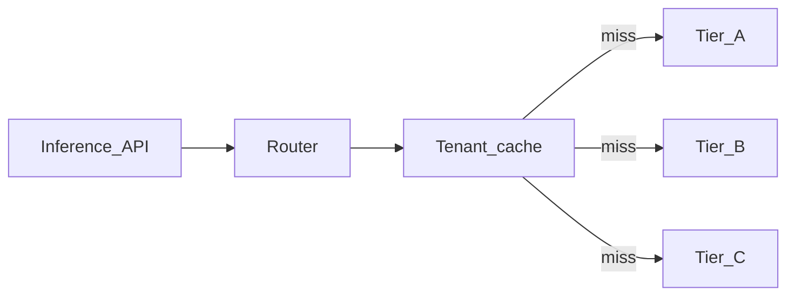
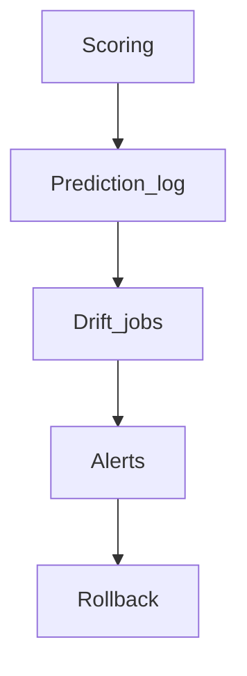

# HR ERP MLOps — extended reference

## Inference tiers (summary)

| Tier | Models | Use cases |
|------|--------|-----------|
| A | SLM / small | Policy Q&A, intent, extraction, FAQ, short summarize |
| B | Mid LLM | Ambiguity, multi-step explanation, tone-sensitive drafts |
| C | Large / frontier | Rare executive synthesis; never automatic default |

## Cost / latency tactics

- Cap RAG chunks and total retrieved tokens; prefer structured “HR facts”.
- Stream only when UX requires it; batch reports and bulk scoring separately.
- Self-hosted: quantization / smaller checkpoints; API usage: tool-light Tier A paths.

## Drift dimensions

- **Input:** feature distributions vs baseline (PSI, KS), missingness.
- **Output:** score histograms, calibration when labels exist (ECE, Brier).
- **Business:** action rates (alerts sent) vs score shifts.
- **Segment:** geography, job family—global OK but one segment broken.

**Label latency:** backfill attrition labels; use **proxy** signals early (engagement, surveys) as Tier-2 evidence only.

## Agent / MCP isolation patterns

| Pattern | Isolation | Cost |
|---------|-----------|------|
| Per-tenant MCP | Strongest | Highest |
| Shared MCP + stateless requests + per-request token | Strong | Medium |
| Single MCP trusting client `tenant_id` | Weak | **Avoid** |

## Threats (short list)

- **Cross-tenant tool call** — strip untrusted tenant hints; orchestrator-issued JWT only.  
- **Confused deputy** — no long-lived tokens shared across tenants without pool reset.  
- **Over-privileged agent** — allowlists + ABAC on side effects.  
- **Prompt injection** — quotas, human confirmation on bulk export, output filtering.  
- **Log leakage** — redact; no full prompts in app logs.  
- **Sandbox escape** — ephemeral workers, read-only FS, egress allowlist.

## Mermaid — inference path

## Mermaid — drift loop

