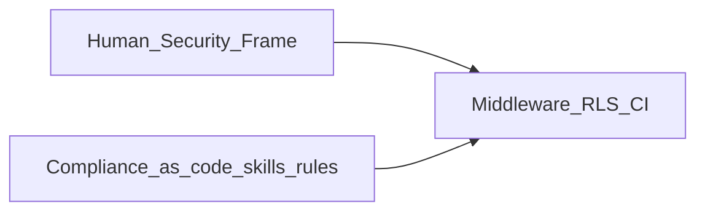
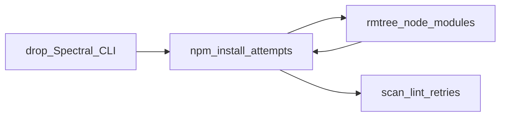

# Collaboration post-mortem (Principal Systems Auditor)

Recorded artifact for swarm collaboration audit requested by the Human Lead. Cursor parent transcript: [Security swarm audit transcript](49235615-dea5-4715-86ce-e871d21e1cab).

**Related tooling (repo)**

- Trace stub (all scopes): [specs/templates/golden-thread-trace-table.md](../../specs/templates/golden-thread-trace-table.md)
- Regulated pay/time drill: [specs/templates/golden-thread-regulated-payroll-drill.md](../../specs/templates/golden-thread-regulated-payroll-drill.md)
- Multi-agent rerun checklist: [specs/templates/swarm-multiagent-rerun-checklist.md](../../specs/templates/swarm-multiagent-rerun-checklist.md)

## Scope and provenance

| Dimension | Observation |
| --- | --- |
| **Episode audited** | Most recently modified workspace parent transcript `[49235615-dea5-4715-86ce-e871d21e1cab]` by Cursor transcript ordering metadata |
| **What it actually is** | One continuous assistant thread executing a Human-authored “Principal Application Security & Identity Architect” persona → code/docs/CI/scripts → “persist as agent skill” wiring |
| **What it is not** | Sixteen coordinated delegated personas with independent Task payloads (Legal/Math/QA lanes exist as [.cursor/rules/](../../.cursor/rules/) + skills but **were not staffed** as subagents for this transcript) |

“Agents” below mean **intended choreography roles**. Inactive lanes are recorded honestly—no invented fights between Backend vs Janitor.

## Communication audit

| Question | Finding |
| --- | --- |
| **Did the Orchestrator provide sufficient context to sub-agents?** | **No sub-agent handoffs observed** — no separate delegated Task payloads. Direction flowed from repeating Human prompts; Implementation inferred scope from plan text plus repo exploration. Formal Orchestrator context packing (**Feature brief path, ≤6-line PO checkpoint, phased ADRs on every delegated Task** per [.cursor/rules/orchestrator.mdc](../../.cursor/rules/orchestrator.mdc)) **was not exercised** in-session. Post-audit remediation: verbatim Task preamble **bullet 6** in that rule + [`swarm-multiagent-rerun-checklist.md`](../../specs/templates/swarm-multiagent-rerun-checklist.md). |
| **Hallucinations vs HR Program Manager spec?** | No authoritative Program Manager brief in-thread; additive scope (**skill persistence**) traced to explicit Human prompts. **World-model drift**: early turns implied empty workspace vs later scaffold work—risk of rework; hardened by **Architect vs Builder splitter** (+ list-root before asserting empty). |
| **Signal-to-noise** | Duplicate “Implement the plan…” bursts look like UX resend friction; convergence still landed via Todo closure + consolidated recap. |

## Logic traceability (“golden thread”: Legal → Compliance → Payroll kernel → QA)

**Verdict:** **Thread incomplete by construction**, not mis-handoff mid-pipeline—the specialist sequence never activated.

Details:

- **Legal / counsel:** inactive (no [`legal-checklist.md`](../../specs/templates/legal-checklist.md) excerpts or ADRs in transcript).
- **Backend compliance matrices (`hr-backend-compliance`):** inactive (expected when pay stubs / wage-hour—not this thread’s core scope).
- **Payroll calculation kernel (`packages/payroll-calc/`, `hr-payroll-calculation-engine`):** inactive.
- **QA (`agent-qa`, verbatim UAC):** inactive as a distinct reviewer; defensive automation present (ESLint, [`scripts/security-scan.mjs`](../../scripts/security-scan.mjs)).

**Information leak attribution (meta):** Responsible party = **Orchestration gap at kickoff**, not malpractice by Implementation—the Legal/Math/QA choreography was skipped for this blueprint class.

Recommended future transcripts: cite **numbered UAC** under `docs/product/feature-briefs/` and populate [golden-thread-regulated-payroll-drill.md](../../specs/templates/golden-thread-regulated-payroll-drill.md) when math surfaces change.

Minimal actual chain for this narrow security blueprint:



## Efficiency metrics (“agent loops”)



Roughly **four to seven** terminal-driven tightening cycles occurred around installs / lock coherence before stabilization—not “Backend vs Janitor ten times”; those roles split only in narrative.

Separate **schema/migration-history vs RLS** alignment loop surfaced (conditional `pto_requests`): healthy defensive posture signals **prior migration hygiene** checkpoints before sweeping RLS.

## Innovation vs stability balance

- **`hr-erp-innovation-rd`:** reviewer pass not evidenced tied to infra churn in transcript.
- **Stability pragmatic:** shedding `@stoplight/spectral-cli` after extraction failures prioritized delivery; repo rule now mandates **signals replacement** wording in parity notes ([`hr-erp-innovation-rd` SKILL observability deltas](../../.cursor/skills/hr-erp-innovation-rd/SKILL.md)).

## Final system grades (dual-labeled)

| Score | Meaning | Value /100 |
| --- | --- | ---: |
| **Swarm choreography fidelity** | Distinct lanes + Orchestrator pinning evidenced in transcript | **43** |
| **Episode engineering integrity** | Human security charter → runnable `lib/security/**`, middleware, migrations, CI, persisted skill wiring (local `npm`/full build caveat noted in-thread) | **76** |

**Fused pragmatist grade (~50/50 blend across rubrics): ~58–60 /100** — strong delivery with weak swarm fidelity.

Alternative single-number anchors: **43** when grading “sixteen-role integrity,” **76** when grading “delivery vs blueprint.”

## Collaboration heatmap (pairwise cohesion)

Higher warmth ⇒ co-produced observable artifacts in-thread.


Cold pairs absent evidence: Legal ↔ Backend compliance; Compliance ↔ payroll kernel; Architecture ↔ Kafka/outbox drills; QA ↔ golden vectors verbatim; Innovation parity ↔ Topology gate contests.

ASCII quick-glance (“hot ███” only where collaboration happened):

```
        Legal  CompPay Payroll QA Innov Arch SecImp Human
Legal     ○      ○      ○    ○   ○    ○     ○     ○
CompPay   ○      ○      ○    ○   ○    ○     ○     ○
Payroll   ○      ○      ○    ○   ○    ○     ○     ○
QA        ○      ○      ○    ○   ○    ○     ○     ○
Innov     ○      ○      ○    ○   ○    ○     ○     ○
Arch      ○      ○      ○    ○   ○    ○     ○     ○
SecImp    ○      ○      ○    ○   ○    ○     ███   ███
Human     ○      ○      ○    ○   ○    ○     ███    --
● hot (███) ○ inactive
```

## System tuning (encoded in-repo)

Governance deltas post-audit live in [.cursor/rules/orchestrator.mdc](../../.cursor/rules/orchestrator.mdc) (**Transcript fidelity**, **Architect vs Builder splitter**, **verbatim delegated Task preamble**), [.cursor/rules/agent-qa.mdc](../../.cursor/rules/agent-qa.mdc) (**security-plane smoke matrix**), and [.cursor/skills/hr-erp-innovation-rd/SKILL.md](../../.cursor/skills/hr-erp-innovation-rd/SKILL.md) (**observability deltas** mandate). Agents performing future audits should load the reusable **`@hr-erp-collaboration-audit`** skill: [.cursor/skills/hr-erp-collaboration-audit/SKILL.md](../../.cursor/skills/hr-erp-collaboration-audit/SKILL.md).

Operational paste blocks for Humans/Orchestrators issuing Tasks:

```
PO orchestration checkpoint: brief path ___ | UAC count ___ | gate Y/N |
friction refs Y/N | phase ADR: ___ | Payroll/Compliance/Math N lines
```

## Operational follow-up (multi-agent rerun)

Complete [swarm-multiagent-rerun-checklist.md](../../specs/templates/swarm-multiagent-rerun-checklist.md), then rerun the capability with **delegated Tasks** so transcript logs each specialist’s verbatim I/O anchored to **one Feature brief**.

## Closing meta-note (integrity)

This audit deliberately **does not** fabricate conflict between hypothetical Backend/Janitor agents when transcripts omit them — methodological honesty beats inflating choreography scores without evidence.
