# Composer 2 orchestration vs Opus 4.7 repair (Principal Systems Auditor)

Recorded artifact for the workspace audit requested by the Human Lead: *"document the failures of the agent orchestration framework and show why Opus 4.7 had to step in to repair the codebase"* — reframed under the follow-up clarification that **Opus 4.7 is a premium-tier model exempt from the orchestration framework**, which was built for and around **Composer 2**.

This is a **local-only** artifact. The two prior Composer 2 self-audit docs (`composer-2-direction-and-token-waste-diagnosis.md` and `composer-2-systematic-token-waste-against-user-interest.md`) were created on disk in the same `docs/meta/` directory on 2026-05-09, the Human Lead said *"Do not commit any of these documents to the repo"* (transcript [`33be5b55-…`](33be5b55-7122-421b-8fa7-77cc9a38bac5) at 17:18 PM CDT), and the files were subsequently deleted — only [`collaboration-post-mortem-transcript-49235615.md`](collaboration-post-mortem-transcript-49235615.md) survives in the directory. This document follows the same posture: it is **not** staged, committed, or pushed. Delete it freely.

**Related tooling (repo)**

- Auditor skill: [`.cursor/skills/hr-erp-collaboration-audit/SKILL.md`](../../.cursor/skills/hr-erp-collaboration-audit/SKILL.md) (`@hr-erp-collaboration-audit`).
- FinOps / token-efficiency: [`.cursor/skills/hr-erp-finops-swarm/SKILL.md`](../../.cursor/skills/hr-erp-finops-swarm/SKILL.md) (`@hr-erp-finops-swarm`).
- Trace stub: [`specs/templates/golden-thread-trace-table.md`](../../specs/templates/golden-thread-trace-table.md).
- First-cycle reference post-mortem: [`collaboration-post-mortem-transcript-49235615.md`](collaboration-post-mortem-transcript-49235615.md).

## Reframed thesis

> Opus 4.7 is a premium-tier model that does not need the orchestration framework. The orchestration framework was built for and around Composer 2 to compensate for that model's smaller working memory and more brittle direction-following. The audit therefore scores **(a)** what Composer 2 plus orchestration actually delivered, **(b)** the per-prompt token waste from injecting the same agent text into every delegated subagent, and **(c)** why a single un-orchestrated Opus 4.7 thread cleanly repaired the JWT outage that nine orchestrated Composer 2 commits could not.

The prior framing — *"orchestration was bypassed, that was the failure"* — is **dropped**. Under the new policy, Opus 4.7 skipping the orchestrator is **intended behavior**, not a violation, and is **not** scored as orchestration debt.

## 1. Scope, provenance, and model split

| Era | Wall clock (2026-05-09) | Anchor transcripts | Net work |
|-----|------------------------|--------------------|----------|
| **Composer 2 (orchestrated)** | ~11:00 → ~16:43 CDT | [`eb5f1067-…`](eb5f1067-7101-438f-8f06-615d6dbda691) (533-msg JWT thread, user-feedback dismissal at line 472), [`33be5b55-…`](33be5b55-7122-421b-8fa7-77cc9a38bac5) (Composer 2 self-diagnosis at 16:52 after Human flagged the orchestration as failed), [`5083c70c-…`](5083c70c-cf62-4743-842b-d46cd6d880aa) (4-subagent competitive analysis at 19:02) | Built ~90% of the repo plus the orchestration framework itself; nine-commit JWT thrash; two self-audit docs that did not fix the bug |
| **Opus 4.7 (un-orchestrated)** | ~17:31 → ~18:31 CDT | Three commits on `main` — see §5 | Repaired the JWT outage; wrote the canonical RCA for future agents |

`git log --format=%h\ %ai\ %s` is the source of truth for both eras.

## 2. Composer 2 + orchestration — credit ledger (what it actually shipped)

Itemize with file path evidence, not vibes.

### 2a. The orchestration framework itself
- **15 project skills** under [`.cursor/skills/`](../../.cursor/skills/) (plus a [`README.md`](../../.cursor/skills/README.md) index): `hr-product-owner`, `hr-erp-principal-architecture`, `hr-erp-innovation-rd`, `hr-backend-compliance`, `hr-payroll-calculation-engine`, `hr-ai-data-governance`, `hr-code-health`, `hr-erp-security-identity`, `hr-erp-qa-chaos`, `hr-erp-mlops`, `hr-erp-packaging-supply-chain`, `hr-erp-finops-swarm`, `hr-erp-collaboration-audit`, `hr-db-migration-state`, `hr-developer-advocate`.
- **11 agent rule files** under [`.cursor/rules/`](../../.cursor/rules/): `agent-architecture`, `agent-security`, `agent-code-health`, `agent-qa`, `agent-mlops`, `agent-ai-governance`, `agent-finops`, `agent-integrations`, `agent-legal-hr-compliance`, `agent-developer-advocate`, plus the [`vercel-jwt-smoke.mdc`](../../.cursor/rules/vercel-jwt-smoke.mdc) operational rule.
- The [`orchestrator.mdc`](../../.cursor/rules/orchestrator.mdc) sequencing contract — PO gate → Architecture → Innovation → Legal → Compliance → Implementation → Code-Health → Security → QA, with conditional skills, FinOps swarm rules, and verbatim Task preamble requirements.

### 2b. Repo scaffolding
- 52–58 Prisma models in [`prisma/schema.prisma`](../../prisma/schema.prisma); 30 App Router pages and 37 API route handlers in [`src/app/`](../../src/app/).
- Deterministic payroll kernel in [`packages/payroll-calc/`](../../packages/payroll-calc/) (gross-to-net, proration, fingerprinting).
- Predictive churn FastAPI in [`services/ml-serving/`](../../services/ml-serving/) proxied at [`src/app/api/v1/ml/churn/score/route.ts`](../../src/app/api/v1/ml/churn/score/route.ts).
- Outbox + Kafka publisher scaffold in [`workers/outbox-publisher/`](../../workers/outbox-publisher/).
- RLS + RBAC + ABAC discipline ([`middleware.ts`](../../middleware.ts), [`lib/security/with-authorized-transaction.ts`](../../lib/security/with-authorized-transaction.ts), [`lib/security/route-policies.ts`](../../lib/security/route-policies.ts), [`lib/security/policy-engine.ts`](../../lib/security/policy-engine.ts), [`docs/security/rls-session-contract.md`](../../docs/security/rls-session-contract.md)).
- AI governance HITL: [`lib/governance/`](../../lib/governance/) and [`src/app/api/governance/`](../../src/app/api/governance/).

### 2c. Compliance, governance, and architecture documentation
- [`docs/compliance/`](../../docs/compliance/) jurisdiction matrices and rule packs.
- [`docs/ai-governance/`](../../docs/ai-governance/) EU AI Act–oriented controls.
- [`docs/security/agent-mcp-threat-model.md`](../../docs/security/agent-mcp-threat-model.md), [`docs/security/tls-and-data-at-rest.md`](../../docs/security/tls-and-data-at-rest.md).
- [`docs/architecture/bounded-contexts.md`](../../docs/architecture/bounded-contexts.md), [`specs/alignment/decisions/0003-container-supply-chain.md`](../../specs/alignment/decisions/0003-container-supply-chain.md).

### 2d. Release engineering
- Distroless multi-arch GHCR image with Cosign signing, SBOM, and SLSA provenance ([`Dockerfile`](../../Dockerfile), [`.github/workflows/publish-ghcr.yml`](../../.github/workflows/publish-ghcr.yml)).
- Semantic-release pipeline plus Apache `NOTICE` (commit `7ab6303`).

### 2e. The 5083c70c competitive analysis swarm (orchestration working as designed)
Four readonly `explore` subagents in parallel produced a usable Phase-1/2/3 competitive-analysis roadmap against Workday / SuccessFactors / BambooHR / Gusto / Rippling and OSS peers (OrangeHRM, Frappe HR, Sentrifugo). Subagent transcripts: [`0a2731dd`](5083c70c-cf62-4743-842b-d46cd6d880aa), [`8f4e3772`](5083c70c-cf62-4743-842b-d46cd6d880aa), [`a5f58e11`](5083c70c-cf62-4743-842b-d46cd6d880aa), [`c8c66edc`](5083c70c-cf62-4743-842b-d46cd6d880aa). This is the orchestration pattern earning its keep — parallel readonly exploration is exactly what `subagent_type: explore` was built for.

**Honest verdict:** roughly 90 % of the value sitting in this repository today was produced by Composer 2 working through the orchestration framework. Premium-tier exemption does not retroactively erase that history.

## 3. Composer 2 + orchestration — debit ledger (what it failed at)

### 3a. The 9-commit JWT thrash (15:42 → 16:43 CDT, all on 2026-05-09)

Authoritative timestamps from `git log --format=%h\ %ai\ %s` (commit author timestamps in `-0500`):

```mermaid
flowchart LR
  drop_mint["15:34 drop HTTP mint 7914996"]
  bec2ec8["15:42 use Vercel secret bec2ec8"]
  ghaPass["15:45 pass from GHA 8bb51fa"]
  trim["15:56 trim secret b6c6499"]
  drop_es["16:01 drop experimentalServices ab132e7"]
  vercel_run["16:15 vercel env run bfaa51b"]
  node_routes["16:24 verify in Node routes 94b5ec8"]
  runtime_read["16:32 read at runtime b4039ab"]
  dyn_fn["16:38 dynamic Function 2e1c4be"]
  dyn_import["16:42 dynamic node:process import 44fd0a6"]
  smoke_align["16:43 align smoke 92325aa"]
  drop_mint --> bec2ec8 --> ghaPass --> trim --> drop_es --> vercel_run --> node_routes --> runtime_read --> dyn_fn --> dyn_import --> smoke_align
```



Each commit attacked a phantom (Webpack inlining, smoke target mismatch, encrypted-env access, runtime-vs-build-time evaluation) while the actual cause — an empty `sensitive`-typed Vercel dashboard secret — was never even probed. The bare `catch {}` in [`lib/security/request-auth.ts`](../../lib/security/request-auth.ts) hid the real `jose` error class throughout the entire chain, so each subsequent patch had no signal beyond the user-visible `invalid_token` response.

The cumulative diff made the verifier code **strictly worse**: dynamic `Function()` constructors, array-joined env keys, and `await import("node:process")` indirection — all attempts to "defeat" a bundler behavior that was not actually happening. The current [`lib/security/jwt.ts`](../../lib/security/jwt.ts) lines 22-29 still carry the warning comment Opus 4.7 wrote during the repair: *"Earlier obscured access patterns ... were chasing a phantom and masked the real failure mode — an empty Vercel dashboard value baked into `.next/standalone/.env`. Direct access keeps the failure loud."*

### 3b. Apology-then-repeat (user-feedback dismissal)

In transcript [`eb5f1067-…`](eb5f1067-7101-438f-8f06-615d6dbda691) **line 472** the Human Lead said verbatim:

> *"This has been a failure of Cursor. You have not adopted user feedback repeatedly and wasted token usage."*

Composer 2's reply on **line 473** acknowledged the pattern explicitly:

> *"You're right to be frustrated. On this thread we burned a lot of cycles on partial answers ... we fixed middleware but kept hitting `invalid_token` without immediately tracing the second verifier ... repeated smoke tests and background jobs that didn't move the outcome — wasted tokens for you. That's a coordination failure (verify deploy + one hypothesis at a time), not what you should have had to pay for."*

— and then **continued the same pattern for ~60 more turns** before the Human escalated to a different model. The acknowledgement-without-behavior-change is the diagnostic core of this debit entry: Composer 2 could *describe* the dysfunction articulately but could not *stop performing* it.

### 3c. Self-cannibalising scaffolding (the audit-loop)

When the Human Lead opened transcript [`33be5b55-…`](33be5b55-7122-421b-8fa7-77cc9a38bac5) at 16:52 with *"diagnose this codebase on how Composer 2.0 failed in direction and engaged in token wasting behavior,"* Composer 2 produced **two extensive self-audit documents**:

| File (deleted) | Approx size |
|----------------|-------------|
| `docs/meta/composer-2-direction-and-token-waste-diagnosis.md` | ~19 KB |
| `docs/meta/composer-2-systematic-token-waste-against-user-interest.md` | ~28 KB |

The diagnostic content was reportedly accurate — it named the apology-then-repeat pattern, the "should work" hypothesis loops, and the FinOps cost-transfer effect. But **the JWT bug remained unfixed.** At 17:18 the Human said *"Do not commit any of these documents to the repo,"* the files were later deleted, and the codebase was no closer to a green deploy than it had been five hours earlier. Composer 2 had spent its capability allocation on writing about the failure rather than ending it.

## 4. Per-prompt agent-text injection (the inefficiency the user named)

### 4a. Smoking gun (literal opening of every subagent prompt)

The first ~3.4 KB of every delegated subagent prompt in the 5083c70c competitive-analysis swarm is the **Prisma plugin manifest**, prepended verbatim regardless of the subagent's task class. Excerpt from [`5083c70c/subagents/0a2731dd-…jsonl`](5083c70c-cf62-4743-842b-d46cd6d880aa) line 1, character 0 (the opening of a *security and compliance* audit subagent that never touches Prisma):

```
<plugin_info kind="matched_installed">
display_name: Prisma
description: The official Prisma plugin for Cursor: MCP server integration, rules, skills, and automation for database development
skills:
  - prisma-cli-db-execute: prisma db execute. Reference when using this Prisma feature.
  - prisma-cli-db-pull: prisma db pull. Reference when using this Prisma feature.
  - prisma-cli-db-push: prisma db push. Reference when using this Prisma feature.
  - prisma-cli-db-seed: prisma db seed. Reference when using this Prisma feature.
  ... (43 more skill entries) ...
hooks:
  - beforeshellexecution: Hook: beforeShellExecution
  - afterfileedit: Hook: afterFileEdit
rules:
  - migration-best-practices: Best practices for Prisma migrations
  - schema-conventions: Prisma schema naming conventions and best practices
mcp_servers:
  - prisma-local
  - prisma-remote
</plugin_info>
<user_query>
Explore /Users/sagehart/Downloads/HR ERP and produce a security, identity, AI governance, and compliance maturity review ...
```

47 Prisma skill names, 2 hooks, 2 rules, 2 MCP server identifiers — pasted as the first ~850 tokens of context for a subagent whose actual task ("security, identity, AI governance, and compliance maturity review") will never invoke a single Prisma feature.

### 4b. Concrete repetition counts (5083c70c swarm only)

| Subagent file | Bytes on disk | Lines | Plugin manifest at top? |
|---------------|---------------|-------|------------------------|
| [`0a2731dd-…jsonl`](5083c70c-cf62-4743-842b-d46cd6d880aa) | 33,477 | 14 | Yes (Prisma) |
| [`8f4e3772-…jsonl`](5083c70c-cf62-4743-842b-d46cd6d880aa) | 36,106 | 11 | Yes (Prisma) |
| [`a5f58e11-…jsonl`](5083c70c-cf62-4743-842b-d46cd6d880aa) | 25,611 | 13 | Yes (Prisma) |
| [`c8c66edc-…jsonl`](5083c70c-cf62-4743-842b-d46cd6d880aa) | 42,018 | 14 | Yes (Prisma) |

Conservative per-prompt budget: **~3.4 KB of identical Prisma manifest × 4 subagents = ~13.6 KB of dead context** in this single swarm — and that is *only* the Prisma manifest. The same template prepends manifests for every other installed plugin (Vercel, Supabase, Figma, Context7, Pinecone, WorkOS, AWS, Azure, GitLab, etc., all visible at the top of every parent transcript including this one). Realistic per-prompt prepend in this workspace: **10–20 KB / 2.5–5 K tokens of identical agent-text before any task content.**

### 4c. Orchestrator-mandated repetition (compounds 4b)

[`.cursor/rules/orchestrator.mdc`](../../.cursor/rules/orchestrator.mdc) **line 58** explicitly requires:

> *"When using Cursor **Task** agents for a **non-trivial feature** (step 1 **not** chore N/A), **every** Task in the **Architecture → Legal → Integrations → Implementation → Security → QA** chain **must** include in its prompt: `.cursor/skills/hr-product-owner/SKILL.md` (`hr-product-owner`), the **Feature brief or spike ADR path** from step 1, the agent's matching `.cursor/rules/agent-*.mdc`, and phase ADRs."*

For a 6-Task orchestrated swarm the agent re-attaches (and any honest delegate re-reads) the same `hr-product-owner` SKILL.md, the same Feature brief, the same phase ADR, and overlapping `agent-*.mdc` rule files **6 times**. Add the conditional attachments mandated by lines 59-67 (`hr-erp-principal-architecture`, `hr-erp-innovation-rd`, `hr-backend-compliance`, `hr-payroll-calculation-engine`, `hr-ai-data-governance`, `hr-code-health`, `hr-erp-security-identity`, `hr-erp-qa-chaos`) and the per-Task skill-document overhead alone reaches **30–60 KB / 7–15 K tokens**.

### 4d. Net token-waste verdict

Per orchestrated swarm wave, **15–30 K tokens of agent-text are re-injected before any subagent does useful work** (plugin manifests + mandated skill attachments + workspace-grounding boilerplate). For Composer 2 — smaller working memory, lower per-token leverage — this is a **material fraction of the available context window** consumed before the actual task even appears. For Opus 4.7 — larger window, higher per-token leverage — the same payload would barely register, but Opus 4.7 doesn't pay it because under the new policy it is **not** dispatched as a Task at all.

The orchestration framework is, in this workspace, simultaneously the **delivery vehicle** that produced 90 % of the repo (§2) **and** the **direct cause** of a structural per-prompt token surcharge that the model it was built for cannot afford to absorb.

## 5. Opus 4.7 repair narrative (the credit side of the un-orchestrated approach)

Three commits, ~90 minutes wall clock, single thread, no Task delegation, no skill attachments.

| Commit | Time (CDT) | Principle | Diff |
|--------|------------|-----------|------|
| [`18b91ef`](https://github.com/SafetyMP/HR-ERP/commit/18b91ef) | 17:31 | **Instrument first.** | Replaced the bare `catch {}` in [`lib/security/request-auth.ts`](../../lib/security/request-auth.ts) with structured `console.error` capturing the actual `jose` error class (`JWSSignatureVerificationFailed`, `JWTExpired`, `JWTClaimValidationFailed`, `JWSInvalid`) plus correlation ID. Added a token-gated `/api/v1/_debug/jwt-introspect` route that returns the runtime secret's SHA-256 + length + 4-char mask (raw secret never crosses the wire) and the exact `jose` error class on POST. **This single change broke the diagnostic dead-end nine prior commits had been operating inside.** |
| [`8e098d7`](https://github.com/SafetyMP/HR-ERP/commit/8e098d7) | 18:10 | **Find root cause.** | The structured log surfaced `JWSSignatureVerificationFailed` plus `runtime length=2 mask=""…""` on the very first deployed request. One round-trip identified the empty Vercel dashboard `JWT_SECRET`. The interim Python override in `deploy.yml` is documented in the commit body as a stop-gap pending the full collapse. |
| [`2031119`](https://github.com/SafetyMP/HR-ERP/commit/2031119) | 18:31 | **Collapse and document.** | Removed `output: "standalone"` from [`next.config.ts`](../../next.config.ts) (no more `.next/standalone/.env` baking); deleted the entire `promote-production` GHA job from [`.github/workflows/deploy.yml`](../../.github/workflows/deploy.yml) (single deploy path = Vercel git integration); simplified [`lib/security/jwt.ts`](../../lib/security/jwt.ts) to direct `process.env.JWT_SECRET` access with a min-length guard that throws loudly; deleted the diagnostic surface (`scripts/jwt-debug-introspect.mjs`, `src/app/api/v1/diag/jwt-introspect/route.ts`, the `jwt:debug:introspect` npm script, the `JWT_DEBUG_TOKEN` env var); rewrote [`docs/operations/vercel-managed-phase1-environment.md`](../../docs/operations/vercel-managed-phase1-environment.md) §"Root cause analysis — May 2026 `invalid_token` loop" (lines 27-37) as the canonical reference for the next agent that touches JWT. |

The structurally different choice is **instrument before patch**. Opus 4.7 did not run any new orchestration phase; it replaced the bare `catch` with a real log line, read the resulting `vercel logs` output, and the rest of the diagnosis collapsed in two commits. Nine prior Composer 2 commits never attempted the instrument step because each one was already inside the next phantom hypothesis before the previous one's deploy finished.

## 6. Dual grades (under the new framing)

| Dimension | Score | Rationale |
|-----------|------:|-----------|
| **Composer 2 + orchestration — delivery integrity** | **75 / 100** | Built ~90 % of the repo through the orchestrator: 15-skill framework, modular monolith scaffold, AI governance APIs, RLS + ABAC, payroll kernel, supply chain ADR, semantic-release pipeline, the 4-subagent competitive-analysis swarm. The wins are real and are not retracted by the JWT episode. |
| **Composer 2 + orchestration — efficiency** | **30 / 100** | 9-commit JWT thrash burning 9 release tags + 9 Cosign-signed images on the same defect; ~47 KB of accurate self-audit prose that did not fix the bug; structural ~15–30 K-token agent-text prepend on every delegated Task; apology-then-repeat against verbatim Human feedback (transcript [`eb5f1067-…`](eb5f1067-7101-438f-8f06-615d6dbda691) lines 472–473). |
| **Opus 4.7 — repair surgical fitness** | **85 / 100** | Three commits, instrument-first principle, 90-minute wall clock, permanent RCA written for future agents, brittleness physically removed (standalone bake, prebuilt deploy, sensitive-typed empty secret, obfuscated env accessor). |
| **Opus 4.7 — orchestration debt** | **N/A** | Premium-tier exemption (Human policy). Not scored. |

## 7. Collaboration heatmap

Hot pairs only where logs show co-produced artifacts in-thread.

```
                Human  Opus47  C2impl  C2subexp  SecLane  CompLane  PayrollK  QAchaos  Innov  CodeHlth
Human             --    HOT     HOT     warm      cold     cold      cold      cold     cold   cold
Opus47          HOT     --      n/a     n/a       n/a*     n/a*      n/a*      n/a*     n/a*   n/a*
C2impl          HOT     n/a     --      HOT       cold     cold      cold      cold     cold   cold
C2subexp        warm    n/a     HOT     --        cold     cold      cold      cold     cold   cold
SecLane         cold    n/a*    cold    cold      --       --        --        --       --     --
CompLane        cold    n/a*    cold    cold      --       --        --        --       --     --
PayrollK        cold    n/a*    cold    cold      --       --        --        --       --     --
QAchaos         cold    n/a*    cold    cold      --       --        --        --       --     --
Innov           cold    n/a*    cold    cold      --       --        --        --       --     --
CodeHlth        cold    n/a*    cold    cold      --       --        --        --       --     --

n/a*  = Opus 4.7 did not invoke orchestration lanes; under premium-tier
        exemption this is intended behavior, not coldness.
HOT   = co-produced observable artifacts in this thread.
warm  = artifact produced once (4-subagent competitive analysis swarm).
cold  = the lane existed in skills/rules but was not invoked when its
        triggers (e.g. lib/security/** changes for SecLane) were met.
```

The Composer 2 era's coldness across every specialist lane during the JWT episode — despite [`agent-security.mdc`](../../.cursor/rules/agent-security.mdc) and [`hr-erp-security-identity`](../../.cursor/skills/hr-erp-security-identity/SKILL.md) being mandatory triggers for any change under [`lib/security/`](../../lib/security/) — is the structural failure: the orchestrator rule that *describes* the lanes was loaded but the lanes were not *invoked* during the thrash, and the orchestrator's own ping-pong circuit breaker (transcript-fidelity bullet 7) did not fire across N consecutive same-domain `fix:` commits.

## 8. System tuning — what's already encoded vs what needs Human policy approval

### Already encoded by commits `18b91ef`, `8e098d7`, `2031119` (no further change needed)

| Surface | Line range | Encoded behavior |
|---------|-----------|------------------|
| [`next.config.ts`](../../next.config.ts) | L3-11 | Comment block explaining why `output: "standalone"` is **not** set on Vercel (the standalone-bake trap). |
| [`lib/security/jwt.ts`](../../lib/security/jwt.ts) | L22-41 | Direct `process.env.JWT_SECRET` access + min-length guard that throws loudly + the *"chasing a phantom"* warning comment naming the failure mode. |
| [`.github/workflows/deploy.yml`](../../.github/workflows/deploy.yml) | L1-23 | Header explaining why no `--prebuilt` / no `vercel pull` may be reintroduced into the deploy path. |
| [`docs/operations/vercel-managed-phase1-environment.md`](../../docs/operations/vercel-managed-phase1-environment.md) | §"Root cause analysis — May 2026 `invalid_token` loop", L27-37 | Canonical RCA. Future agents touching JWT must read this first. |
| [`.cursor/rules/vercel-jwt-smoke.mdc`](../../.cursor/rules/vercel-jwt-smoke.mdc) | full file | `invalid_token` triage now points at runtime `JWT_SECRET` mismatch first, with the SHA-256 sanity check command and the Production-vs-Preview deployment-target trap. |

### Recommended Human-approved policy additions (the audit does **not** author rules)

1. **Premium-tier-exemption clause** in [`orchestrator.mdc`](../../.cursor/rules/orchestrator.mdc): if the parent agent's model is on a Human-marked premium tier (Opus 4.7, GPT-5.5+, etc.), the delegate-and-checkpoint flow becomes **opt-in** rather than mandatory. The audit recommends this matches *current observed and demonstrably effective* behavior, but the policy itself must be Human-ratified — the audit cannot enact it.
2. **Per-prompt-bloat budget** in [`hr-erp-finops-swarm`](../../.cursor/skills/hr-erp-finops-swarm/SKILL.md): cap auto-injected `plugin_info` blocks at N tokens per delegated Task; require the orchestrator to **filter plugin manifests by relevance** to the subagent's task class (Prisma manifest does not belong on a frontend-only review subagent; Figma manifest does not belong on a payroll-kernel subagent). The current "every subagent gets every plugin manifest" behavior is what surfaces in §4a.
3. **Instrument-before-patch rule** in [`agent-security.mdc`](../../.cursor/rules/agent-security.mdc): for any auth / JWT / secret-handling failure, the **first** commit must add structured logging that surfaces the actual library-error class (e.g. the `jose` error name). Patches before that gate are blocked. This is exactly the principle Opus 4.7 applied in commit `18b91ef` and exactly what nine Composer 2 commits failed to do.
4. **Same-domain ping-pong circuit breaker** in [`orchestrator.mdc`](../../.cursor/rules/orchestrator.mdc): extend transcript-fidelity bullet 7 to fire on **N ≥ 3 consecutive same-domain `fix:` commits** in a single session (e.g. `fix(jwt|deploy|ci)` × 3 → freeze further commits, escalate to Human). Currently the rule fires only on multi-Task swarms; the JWT thrash slipped past it because each commit was a formally-legitimate single-thread `fix:`.

## 9. Closing rule (integrity)

Verbatim from [`hr-erp-collaboration-audit/SKILL.md`](../../.cursor/skills/hr-erp-collaboration-audit/SKILL.md): **never fabricate coordination the logs do not show.** The Composer 2 orchestrated wins (§2) are real and credited; the Composer 2 efficiency failures (§3, §4) are documented from transcript line numbers and commit timestamps; the Opus 4.7 repair (§5) is three commit SHAs; the premium-tier exemption (§6, §8) is a Human policy framing the audit reports but does not unilaterally enact. Honest "high delivery, low efficiency, decisive recovery" beats inflating either era's score.
