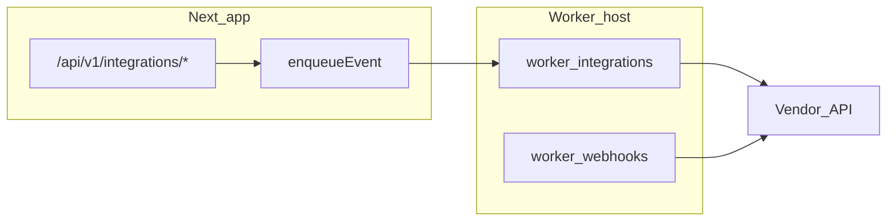

# RFC: Vendor connector framework (beyond webhooks)

**Status:** Draft  
**Date:** 2026-05-18  
**Roadmap:** [specs/competitive-analysis-roadmap.md](../../specs/competitive-analysis-roadmap.md) P2

## Problem

Mid-market buyers expect Rippling-class integration breadth (payroll ADP, benefits carriers, IdP, ATS). HR ERP ships **domain webhooks** (ADR 0008) but not a uniform connector SDK for bidirectional vendor I/O.

## Goals

1. Tenant-scoped credentials with encryption at rest (reuse `INTEGRATION_SECRET_KEY` patterns).
2. Idempotent inbound sync + outbox-backed outbound jobs (BullMQ `worker:integrations`).
3. Observable DLQ + replay (`integrations:replay-dlq`).

## Non-goals (Phase 1)

- Full Rippling app store
- Real-time Kafka bus (ADR 0001 defer)

## Proposed architecture

## Connector contract (`lib/connectors/sdk.ts`)

| Method | Purpose |
| --- | --- |
| `validateCredentials()` | Health check on install |
| `pullInbound(cursor)` | Incremental sync |
| `pushOutbound(event)` | Map domain event → vendor payload |
| `handleWebhook(req)` | Verify signature + normalize |

## Phased delivery

| Phase | Deliverable |
| --- | --- |
| **P2a** | RFC + stub connector registry + ADP/Gusto spike interface |
| **P2b** | Benefits 834 connector package (`packages/connectors/edi-834/`) per [us-benefits-cobra-aca-834.md](../compliance/us-benefits-cobra-aca-834.md) |
| **P2c** | SCIM / WorkOS directory sync (optional) |

## Security

- HMAC webhook verification (existing)
- OAuth refresh token storage encrypted
- ABAC: `integrations:configure` for HR admin only
- No PII in connector logs

## CI

Python churn smoke already path-filtered in [`.github/workflows/reusable-ci.yml`](../../.github/workflows/reusable-ci.yml) — extend path filters when `packages/connectors/**` lands.

## Open questions

1. Single integration worker vs per-vendor queues?
2. Rate-limit strategy per tenant per vendor?
