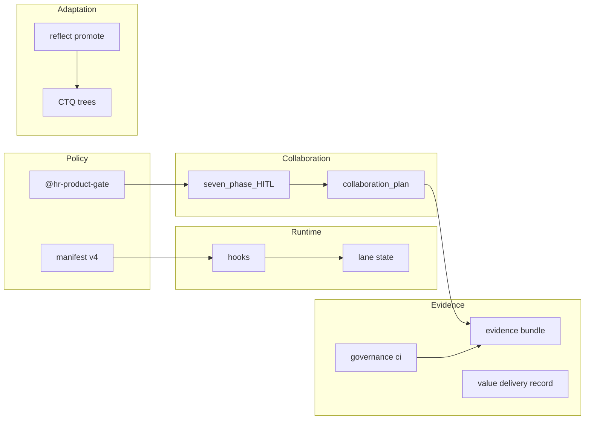

# Agent team map — HR ERP

**Canonical roster:** function lanes → agent rules → skills → frameworks. Load this first; do not duplicate ADR bodies here.

Operator runtime: [cursor-3-native-runtime.md](cursor-3-native-runtime.md) · Team skills: [.cursor/skills/README.md](../../.cursor/skills/README.md)

## Five planes

| Plane | Owns | Key artifacts |
|-------|------|----------------|
| **Policy** | Tiers, lanes, rules, skills | [governance-manifest.yaml](../../.cursor/governance/governance-manifest.yaml), ADRs, feature briefs |
| **Runtime** | Hooks, lane state, MCP allowlist | [hooks.json](../../.cursor/hooks.json), session-lane-state |
| **Evidence** | CI, handoffs, bundles, VDR | `governance:ci`, evidence bundles, value-delivery-record |
| **Adaptation** | Ledger, reflect, promote | `@hr-governance-learning`, DMAIC/PDCA |
| **Collaboration** | Harness HITL loop, human decisions | `@hr-human-collaboration`, [collaboration-plan.md](../../specs/templates/collaboration-plan.md), `collaborationPlan` JSON |

Value and efficiency are **cross-cutting** (PO gate → VDR → IBP), not a sixth plane — [ADR 0019](../../specs/alignment/decisions/0019-harness-phase2-evidence-adaptation-runtime.md). Collaboration plane (Harness HITL) is distinct from Product HITL — [ADR 0020](../../specs/alignment/decisions/0020-collaboration-plane-harness-hitl.md).

## Function lanes → skills

| Lane | Agent rule | Primary skill(s) | Min tier |
|------|------------|------------------|----------|
| scout / architect | agent-architecture, agent-nextjs | `@hr-domain-boundaries`, `@nextjs-app-router`, `@repo-architect` | T1 |
| builder | agent-code-health | `@lint-and-validate`, `@hr-product-gate` | T1 |
| custodian | agent-db-migration-state | `@prisma-7-postgres`, `@hr-data-custody` | T2 |
| sentinel | agent-security | `@cc-skill-security-review` | T1 |
| verifier | agent-qa | `@vitest-playwright-qa`, `@hr-quality-lab` | T1 |
| counsel | agent-legal-hr-compliance | `@hr-regulated-domain` | T3 |
| ai_governance_reviewer | agent-ai-governance | `@hr-product-mcp-governance`, `@protect-mcp-governance` | T3 |
| mlops_reviewer | agent-mlops | `@hr-regulated-domain` | T3 |
| release_ops | agent-devops-lifecycle | `@hr-devops-lifecycle`, `@devops-product-lifecycle` | T2 |
| packaging | agent-packaging-supply-chain | `@devops-product-lifecycle` | T2 |
| finops_coordinator | agent-finops | `@hr-swarm-governance` | T4 |
| advocate | agent-developer-advocate | `@hr-contributor-handoff` | T1 |
| Human PO | hook inject | `@hr-product-gate` | T1+ |
| Harness CI | human invoke | `@hr-foundation-governance`, `@hr-governance-learning` | T2–T3 |

## Skill load order (manifest v4 + Collaboration phases)

Max **3** skill bodies per sub-task (`@skill-router` + `@governance-tier-gate`). **Specialized** skills (`@hr-regulated-domain`, `@hr-data-custody`, etc.) only after Collaboration phase 6 / `revalidationConfirmed`.

| Phase | Skill phase | Examples |
|-------|-------------|----------|
| 1–3 | routing | `@hr-human-collaboration`, `@hr-product-gate`, `@hr-orchestration-lanes` |
| 4–5, 7 | execution | `@hr-quality-lab`, `@lint-and-validate` |
| 6 | specialized | `@hr-regulated-domain`, `@hr-data-custody`, `@hr-foundation-governance` |

| Tier | Typical load |
|------|----------------|
| T0 | None |
| T1 | human-collaboration routing + product-gate + planning/lint |
| T2 | + data-custody or devops-lifecycle (after revalidation) |
| T3 | + regulated-domain or product-mcp-governance (after revalidation) |
| T4 | + swarm-governance when ≥2 Tasks |

**Human-invoke only** (`disable-model-invocation`): `@hr-foundation-governance`, `@hr-governance-learning`, `@hr-swarm-governance`, `@hr-human-collaboration`.

## Framework facades (global, JIT)

Path-triggered via manifest `frameworkSkills` + `pathTriggers`. Index: `~/.cursor/skills/README.md`.

| Facade | Invoke | Paths | Co-load (HR ERP) |
|--------|--------|-------|------------------|
| Next.js App Router | `@nextjs-app-router` | `app/**`, `middleware.ts` | `@hr-domain-boundaries` |
| Prisma 7 + Postgres | `@prisma-7-postgres` | `prisma/**`, `lib/db/**` | `@hr-data-custody` |
| Vitest + Playwright | `@vitest-playwright-qa` | `tests/**`, `vitest.config.*` | `@hr-quality-lab` |
| Buf + OpenAPI | `@buf-openapi-contracts` | `proto/**`, `contracts/**` | `@repo-architect` |
| Context7 docs | `@context7-doc-fetch` | Lane allows `context7` | — |

Hooks inject `suggestedSkills` from diff classifier; `skillsLoaded[]` tracks composition misses.

## Harness vs adaptation skills

| Skill | Plane | When |
|-------|-------|------|
| `@hr-foundation-governance` | Policy + Evidence setup | Edit manifest, hooks, governance scripts |
| `@hr-governance-learning` | Adaptation | reflect, promote, DMAIC, control plans |
| `@hr-orchestration-lanes` | Runtime recipes | Lane fan-out, `/multitask` |
| `@hr-human-collaboration` | Collaboration | Seven-phase Harness HITL loop |

Phase 2 commands: `npm run governance:evidence`, `governance:cloud-session` — see [governance-continuous-learning.md](governance-continuous-learning.md).

## Framework hierarchy

| Tier | Document | Role |
|------|----------|------|
| Normative | ADR [0010](../../specs/alignment/decisions/0010-agent-risk-tier-governance.md)–[0020](../../specs/alignment/decisions/0020-collaboration-plane-harness-hitl.md) | Decisions |
| Operator | [cursor-3-native-runtime.md](cursor-3-native-runtime.md), [governance-continuous-learning.md](governance-continuous-learning.md), [devops-product-lifecycle-framework.md](devops-product-lifecycle-framework.md) | How to run |
| Industry | [cursor-industry-alignment.md](cursor-industry-alignment.md) | External mapping |
| Product demand | [stakeholder-value-plan.md](../product/stakeholder-value-plan.md), [hr-product-owner-operating-model.md](../product/hr-product-owner-operating-model.md) | What to build |
| **Team roster** | **This doc** | Who does what |

## Quick sequence (operator loop — mandatory T1+)

0. Collaboration phases 1–3: proposal → options → human decision ([collaboration-plan.md](../../specs/templates/collaboration-plan.md))
1. Load **this doc** (team roster) before delegating Tasks
2. `npm run governance:lint` → tier + **Required lanes**
3. `npm run governance:plan` → paste `delegatedTaskPlan` into handoff JSON
4. Native fan-out: `/multitask` · DDL: `/worktree` · T4: Cloud Agents (see [cursor-cloud-agents.md](../operations/cursor-cloud-agents.md))
5. `npm run governance:ci` before merge

Hooks inject PO gate and lane state at runtime — see [hook-mode.json](../../.cursor/governance/hook-mode.json) rollout dates.

Precedence: Human PO → PO checkpoint → counsel → Security merge bar.
