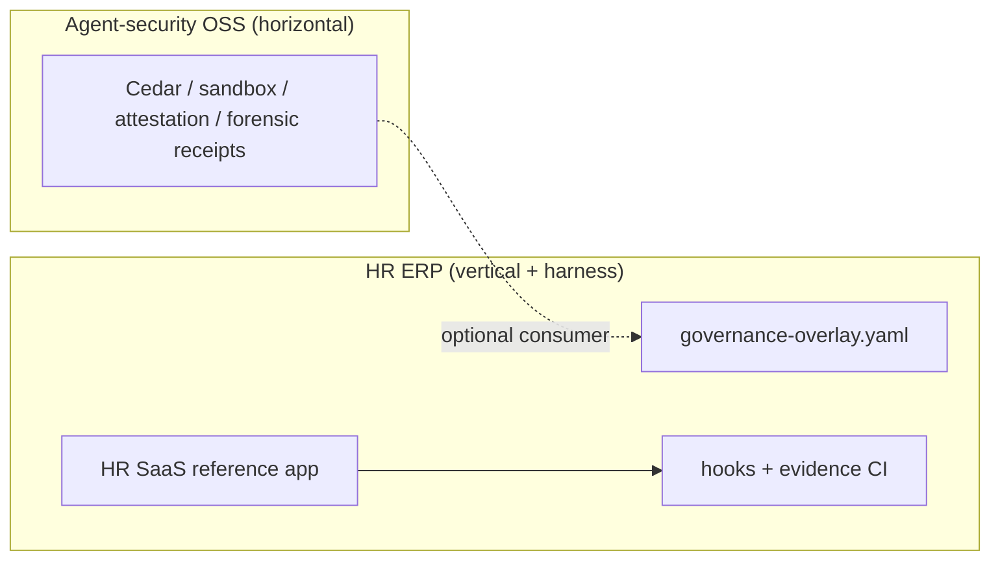

# Evergreen open source positioning

**Status:** Active  
**Audience:** Contributors, fork maintainers, agent-security projects pairing with this repo  
**License:** [Apache 2.0](../../LICENSE)

---

## What HR ERP is

HR ERP is an **evergreen open source reference** for building **multi-tenant HR software** with **agent-governed, compliance-aware development** — not a shrink-wrapped HRIS you deploy unchanged for payroll compliance.

| Layer                       | What you get                                                                                                                                                                             |
| --------------------------- | ---------------------------------------------------------------------------------------------------------------------------------------------------------------------------------------- |
| **HR domain reference**     | Runnable mid-market shapes: employee portal (ESS), manager recruiting, HR/payroll ops, benefits flows, integrations — see [stakeholder value plan](../product/stakeholder-value-plan.md) |
| **Regulated SaaS patterns** | JWT → ABAC → Postgres RLS, deterministic payroll kernel ([`packages/payroll-calc`](../../packages/payroll-calc)), OpenAPI/Buf contracts, counsel-gated compliance docs                   |
| **Agent harness (in-repo)** | Manifest v4, Cursor hooks, evidence bundles, Collaboration plane (Harness HITL) — [cursor-3-native-runtime.md](./cursor-3-native-runtime.md)                                             |

Fork it to **learn**, **extend** (jurisdictions, IdP, compliance packs), or **wire your own agent-security gateway** using the overlay pattern in [global-agent-governance-overlay.md](./global-agent-governance-overlay.md).

---

## What HR ERP is not

Be explicit in demos, READMEs, and buyer conversations:

- **Not** certified IRS/HMRC e-filing or legal payroll advice — see [us-federal-withholding-placeholder.md](../compliance/us-federal-withholding-placeholder.md) and counsel gates ([cobra-aca-counsel-gate.md](../compliance/cobra-aca-counsel-gate.md)).
- **Not** a promise that multi-database or Kafka topology is **shipped** — targets live in ADRs; production today is a **modular monolith + single Postgres** ([stakeholder value plan §1](../product/stakeholder-value-plan.md)).
- **Not** a replacement for production SecOps runbooks, external agent sandboxes, or your own legal review.

Counsel-blocked or partial win-score items (e.g. W3, W7 COBRA PDF) are **documented boundaries**, not hidden gaps.

---

## Evergreen maintenance focus

Prioritize what stays valuable across years:

| Keep evergreen                                 | Label clearly / defer                                |
| ---------------------------------------------- | ---------------------------------------------------- |
| ESS / manager / HR routes as teaching surfaces | Track B buyer OKRs as the only public success metric |
| `payroll-calc` + audit fingerprints            | “Install and run HR for 5,000 employees” positioning |
| Multi-tenant security model (RLS, auth)        | Track D / lab routes in buyer-facing materials       |
| Feature-brief + UAC product discipline         | Inflating UAC counts without PO re-baseline          |
| Governance harness docs + example handoffs     | Pretending harness hooks replace human counsel       |
| Monthly Next.js security cadence + Auto-review operator posture | Treating Auto-review alone as a merge gate |

**Honest demo (≤30 min):** prove **W1–W5** (one portal, native payroll math, enforceable tenancy, manager hiring) — [stakeholder value plan](../product/stakeholder-value-plan.md). Avoid deferred mock, Track D, and `/global-l10n` lab paths in “shipped product” narratives ([deferred-platform-track.md](../product/deferred-platform-track.md)).

---

## Pairing with agent-security OSS (e.g. FidusGate)

HR ERP and companion **agent execution governance** projects serve different evergreen goals:

| Project role           | Evergreen unit                                                                                                     |
| ---------------------- | ------------------------------------------------------------------------------------------------------------------ |
| **Agent-security lab** | Capability phases: policy simulate, sandbox execute, attestation, syscall/throttle breakers, compliance export     |
| **HR ERP**             | Domain + in-repo harness: HR paths elevate to T3, handoffs, product HITL (`lib/governance/`), copilot Cedar shadow |

**Integration shape (optional):** keep authoritative policy in git (manifest + overlay); use an external gateway for runtime `authorize_tool_call`, forensic packages, and break-glass attestation. Thin Cursor hooks remain as a backstop when the model skips the gateway. HR ERP does **not** require an external gateway to clone and run locally.

---

## Who this is for

- **Full-stack developers** learning modern HR SaaS (Next.js, Prisma, multi-tenant Postgres).
- **Platform engineers** copying tier/lane/evidence patterns into other regulated domains.
- **Agent-security projects** needing a credible regulated **reference consumer** (payroll, employment AI, copilot MCP).
- **Maintainers** extending compliance packs, connectors, or bounded-context extraction — not teams seeking turnkey payroll vendor replacement.

---

## Related docs

| Doc                                                                                   | Purpose                                                       |
| ------------------------------------------------------------------------------------- | ------------------------------------------------------------- |
| [global-agent-governance-overlay.md](./global-agent-governance-overlay.md)            | Per-project manifest overlay; adopt harness in other repos    |
| [agent-team-map.md](./agent-team-map.md)                                              | Lanes, skills, planes                                         |
| [codebase-completion-baseline.md](../product/codebase-completion-baseline.md)         | UAC vs platform vs demo inventory                             |
| [hr-product-owner-operating-model.md](../product/hr-product-owner-operating-model.md) | Feature briefs and PO gates                                   |
| [CONTRIBUTING.md](../../CONTRIBUTING.md)                                              | Contributor bar (unchanged by positioning)                    |
| [.cursor/README.md](../../.cursor/README.md)                                          | Intentional in-repo harness; `npm run publish:check` OSS gate |
