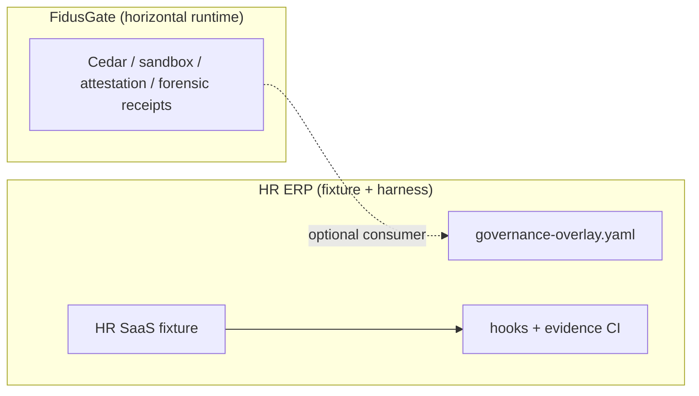

# Evergreen open source positioning

**Status:** Active — aligned with [DESIGN-PIVOT.md](../DESIGN-PIVOT.md) (September 2026)  
**Audience:** Contributors, fork maintainers, agent-security projects pairing with this repo  
**License:** [Apache 2.0](../../LICENSE)

---

## What HR ERP is

HR ERP is an **HR scaffold for testing agent governance** — a runnable multi-tenant SaaS **fixture** so T0–T4 hooks, handoffs, and evidence CI have realistic blast radius. It is **not** a shrink-wrapped HRIS and **not** a certified payroll vendor.

| Layer                       | What you get                                                                                                                                                                             |
| --------------------------- | ---------------------------------------------------------------------------------------------------------------------------------------------------------------------------------------- |
| **Agent harness (in-repo)** | Manifest v4, Cursor hooks, evidence bundles, Collaboration plane (Harness HITL) — [cursor-3-native-runtime.md](./cursor-3-native-runtime.md)                                             |
| **HR fixture domain**       | ESS, manager recruiting, HR/payroll ops, benefits flows — teaching surfaces, not an ERPNext competitor — [stakeholder value plan](../product/stakeholder-value-plan.md)                  |
| **Regulated SaaS patterns** | JWT → ABAC → Postgres RLS, deterministic payroll kernel ([`packages/payroll-calc`](../../packages/payroll-calc)), OpenAPI/Buf contracts, counsel-gated compliance docs                   |

Fork it to **learn the harness**, **extend the fixture** (jurisdictions, IdP, compliance packs), or **wire FidusGate** using the overlay pattern in [global-agent-governance-overlay.md](./global-agent-governance-overlay.md). A later program may rename the repo; **do not rename it in this tree now**.

---

## What HR ERP is not

Be explicit in demos, READMEs, and buyer conversations:

- **Not** a mid-market HRIS product competing with ERPNext, Odoo, or OrangeHRM.
- **Not** certified IRS/HMRC e-filing or legal payroll advice — see [us-federal-withholding-placeholder.md](../compliance/us-federal-withholding-placeholder.md) and counsel gates ([cobra-aca-counsel-gate.md](../compliance/cobra-aca-counsel-gate.md)).
- **Not** a promise that multi-database or Kafka topology is **shipped** — targets live in ADRs; production today is a **modular monolith + single Postgres** ([stakeholder value plan §1](../product/stakeholder-value-plan.md)).
- **Not** a replacement for production SecOps runbooks, external agent sandboxes, or your own legal review.
- **Not** a second Cedar engine — pair [FidusGate](https://github.com/SafetyMP/FidusGate) for runtime receipts.

Counsel-blocked or partial win-score items (e.g. W3, W7 COBRA PDF) are **documented boundaries**, not hidden gaps. Payroll code stays; it is fixture, not a vendor claim.

---

## Evergreen maintenance focus

Prioritize what stays valuable across years:

| Keep evergreen                                 | Label clearly / defer                                |
| ---------------------------------------------- | ---------------------------------------------------- |
| Governance harness docs + example handoffs     | Pretending harness hooks replace human counsel       |
| Multi-tenant security model (RLS, auth)        | Track D / lab routes in “shipped product” narratives |
| ESS / manager / HR routes as **fixture** surfaces | Track B buyer OKRs as the only public success metric |
| `payroll-calc` + audit fingerprints            | “Install and run HR for 5,000 employees” positioning |
| Feature-brief + UAC product discipline         | Inflating UAC counts without PO re-baseline          |
| Monthly Next.js security cadence + Auto-review operator posture | Treating Auto-review alone as a merge gate |

**Honest demo (≤30 min):** prove **W1–W5** (one portal, native payroll math, enforceable tenancy, manager hiring) as **fixture walks** — [stakeholder value plan](../product/stakeholder-value-plan.md). Avoid deferred mock, Track D, and `/global-l10n` lab paths in “shipped product” narratives ([deferred-platform-track.md](../product/deferred-platform-track.md)).

---

## Pairing with agent-security OSS (e.g. FidusGate)

HR ERP and companion **agent execution governance** projects serve different evergreen goals:

```mermaid
flowchart LR
  subgraph horizontal ["FidusGate (horizontal runtime)"]
    Gateway[Cedar / sandbox / attestation / forensic receipts]
  end
  subgraph vertical ["HR ERP (fixture + harness)"]
    App[HR SaaS fixture]
    Overlay[governance-overlay.yaml]
    Harness[hooks + evidence CI]
  end
  Gateway -.->|optional consumer| Overlay
  App --> Harness
```

| Project role           | Evergreen unit                                                                                                     |
| ---------------------- | ------------------------------------------------------------------------------------------------------------------ |
| **FidusGate**          | Runtime receipts: policy simulate, sandbox execute, attestation, syscall/throttle breakers, compliance export     |
| **HR ERP**             | Fixture + in-repo harness: HR paths elevate to T3, handoffs, product HITL (`lib/governance/`). **Do not duplicate Cedar here.** |

**Integration shape (optional):** keep authoritative policy in git (manifest + overlay); use FidusGate for runtime `authorize_tool_call`, forensic packages, and break-glass attestation. Thin Cursor hooks remain as a backstop when the model skips the gateway. HR ERP does **not** require FidusGate to clone and run locally.

---

## Who this is for

- **Platform engineers** copying tier/lane/evidence patterns into other regulated domains.
- **Agent-security projects** (especially FidusGate consumers) needing a credible regulated **fixture** (payroll-shaped writes, employment AI, copilot MCP).
- **Full-stack developers** learning multi-tenant Next.js + Prisma + RLS — with the honest label that the HR module is a teaching surface.
- **Maintainers** extending the harness or fixture — not teams seeking a turnkey payroll vendor or an ERPNext replacement.

---

## Related docs

| Doc                                                                                   | Purpose                                                       |
| ------------------------------------------------------------------------------------- | ------------------------------------------------------------- |
| [DESIGN-PIVOT.md](../DESIGN-PIVOT.md)                                                 | September 2026 public positioning                             |
| [factory-overlay.md](../factory-overlay.md)                                           | Corporate/site factory contract                               |
| [global-agent-governance-overlay.md](./global-agent-governance-overlay.md)            | Per-project manifest overlay; adopt harness in other repos    |
| [agent-team-map.md](./agent-team-map.md)                                              | Lanes, skills, planes                                         |
| [codebase-completion-baseline.md](../product/codebase-completion-baseline.md)         | UAC vs platform vs demo inventory                             |
| [hr-product-owner-operating-model.md](../product/hr-product-owner-operating-model.md) | Feature briefs and PO gates                                   |
| [CONTRIBUTING.md](../../CONTRIBUTING.md)                                              | Contributor bar (unchanged by positioning)                    |
| [.cursor/README.md](../../.cursor/README.md)                                          | Intentional in-repo harness; `npm run publish:check` OSS gate |
