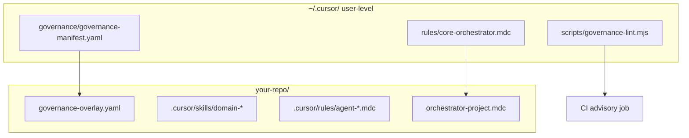

# Global agent governance — per-project overlay pattern

This guide explains how to adopt the **risk-tier modular governance** framework from HR ERP in **any** repository, with canonical policy in `~/.cursor/` and project-specific domain skills locally.

**HR ERP as reference consumer:** This repo is an evergreen OSS **application + harness** showcase — not only a governance adopter. Scope and pairing with external agent-security OSS: [evergreen-open-source-positioning.md](./evergreen-open-source-positioning.md).

**Normative ADR (seed):** [specs/alignment/decisions/0010-agent-risk-tier-governance.md](../alignment/decisions/0010-agent-risk-tier-governance.md)

## Architecture



## Step 1 — Install global core (once per machine)

Ensure these exist on the developer machine:

| Path | Purpose |
|------|---------|
| `~/.cursor/governance/governance-manifest.yaml` | T0–T4 tiers, skill IDs, path triggers, `frameworkSkills`, task bundles |
| `~/.cursor/rules/core-orchestrator.mdc` | Tier-agnostic sequencing (`alwaysApply: true`) |
| `~/.cursor/rules/core-dynamic-skills.mdc` | JIT skill contract — max 3 bodies, no plugin catalog dumps |
| `~/.cursor/skills/README.md` | Global L1 skill index (replaces per-repo skill lists) |
| `~/.cursor/scripts/governance-lint.mjs` | Diff classifier + PR/handoff validator |

HR ERP copies the manifest to [`.cursor/governance/governance-manifest.yaml`](../../.cursor/governance/governance-manifest.yaml) for **CI portability** on GitHub runners (no home-dir manifest). Keep global and project copies in sync when manifest version bumps (**v4** adds YAML loader, `executionGraph.regulated` in plan, handoff `--discover`). Run `npm run governance:sync-check` locally.

## Step 2 — Add project overlay

Create `.cursor/governance-overlay.yaml`:

```yaml
extends: ~/.cursor/governance/governance-manifest.yaml
version: 1

project:
  id: my-app
  name: My Application
  authoritativeRepo: true

skillPaths:
  project: .cursor/skills
  global: ~/.cursor/skills

rulePaths:
  project: .cursor/rules
  global: ~/.cursor/rules

phaseAdr: docs/architecture/phase.md  # adjust
featureBriefs: docs/product/feature-briefs/  # or N/A

templates:
  goldenThread: specs/templates/golden-thread-trace-table.md
  # ... map to your repo's template paths
```

## Step 3 — Project orchestrator rule

Add `.cursor/rules/orchestrator-<project>.mdc` with `alwaysApply: true` that:

1. References `core-orchestrator.mdc` and the manifest
2. Lists **domain-specific** skill IDs and path triggers
3. Includes the verbatim Task preamble with `riskTier`

HR ERP example: [`.cursor/rules/orchestrator-hr-erp.mdc`](../../.cursor/rules/orchestrator-hr-erp.mdc)

Thin entry point: [`.cursor/rules/orchestrator-hr-erp.mdc`](../../.cursor/rules/orchestrator-hr-erp.mdc)

## Step 4 — Domain skills (project-local)

Keep **domain** skills in `<repo>/.cursor/skills/` (e.g. `hr-*` for HR ERP). Register them in:

- Project overlay `additionalPathTriggers` (optional)
- Global manifest `skills` block when shared across multiple HR repos — or a **project-only** overlay section

Portable skills may symlink to `~/.cursor/skills/` but must **ground paths** in the authoritative repo (see [`.cursor/skills/README.md`](../../.cursor/skills/README.md) §5).

## Step 5 — CI wiring

Copy into your repo:

```bash
mkdir -p .cursor/governance scripts
cp ~/.cursor/governance/governance-manifest.yaml .cursor/governance/
cp ~/.cursor/scripts/governance-lint.mjs scripts/
```

Add to `package.json`:

```json
"governance:lint": "node scripts/governance-lint.mjs diff"
```

In CI (**strict** for HR ERP per ADR 0011):

```yaml
- run: npm run governance:ci
- name: PR body strict
  if: github.event_name == 'pull_request'
  run: node scripts/governance-lint.mjs pr-body --strict --body "${{ github.event.pull_request.body }}"
```

Other repos may start advisory; HR ERP blocks on missing `riskTier`, golden thread, and canonical handoff DAG.

## Step 6 — PR and handoff intake

- PR template: declare **`riskTier`**, PO checkpoint, golden-thread table (see [`.github/pull_request_template.md`](../../.github/pull_request_template.md))
- Issue handoff JSON: use [`orchestrator-human-issue-handoff.schema.json`](../templates/orchestrator-human-issue-handoff.schema.json) with enum-validated `conditionalSkills`

## Pinning manifest version

For reproducibility across projects:

1. Bump `version:` in `governance-manifest.yaml`
2. Copy pinned file to each repo's `.cursor/governance/`
3. Record version in overlay:

```yaml
manifestVersion: 1
manifestPin: .cursor/governance/governance-manifest.yaml
```

## Non-HR projects

Replace `hr-*` skills with your domain pack (e.g. `fintech-compliance`, `infra-sre`). Options:

| Approach | When |
|----------|------|
| **Overlay-only triggers** | Small repo; use global T0–T4 without domain skills |
| **Project manifest extension** | Add `skills:` entries in overlay YAML (future schema v2) |
| **Fork manifest** | Multiple repos share a domain; publish manifest fragment |

Rule-only lanes (no skill folder) — document in manifest with `skill: null` (see `agent-legal-hr-compliance`, `agent-integrations` in HR ERP).

## Verification commands

```bash
# Suggest tier from current branch diff
npm run governance:lint

# Validate handoff JSON
node scripts/governance-lint.mjs handoff --file specs/templates/orchestrator-human-issue-handoff.example.json

# Strict PR body check (local)
node scripts/governance-lint.mjs pr-body --file .github/pull_request_template.md
```

## Dynamic skill loading (v4)

1. **Always-on contract** — `core-dynamic-skills.mdc` (global) + repo orchestrator pointer.
2. **Framework facades** — Register in manifest `frameworkSkills` with paths and `coLoad`; wire `pathTriggers` for lanes.
3. **Runtime** — `beforeSubmitPrompt` injects `suggestedSkills`; session tracks `skillsLoaded[]`.
4. **Adaptation** — Promote L2 `skillRouterHints` via `@hr-governance-learning` when composition misses recur.

Do not enumerate global skills in repo `AGENTS.md` — link `~/.cursor/skills/README.md` instead.

## Function-lane harness (v2)

Manifest `agentFunctions` + `executionGraph` replace linear PO→Arch→Legal→Impl waterfalls. Operator guide: [cursor-3-native-runtime.md](cursor-3-native-runtime.md). ADR: [0011](../alignment/decisions/0011-function-lane-orchestration.md).

## Product runtime MCP (Antigravity)

Google Antigravity separates **IDE MCP plugins** from **product-runtime agent tools**. HR ERP mirrors that with two planes — see [antigravity-product-mcp-governance.md](antigravity-product-mcp-governance.md).

| Layer | Global (`~/.cursor/`) | Project (HR ERP example) |
|-------|----------------------|---------------------------|
| Separate axis | `productMcpToolClass` in manifest `separateAxes` | Maps to `CopilotToolDescriptor` + HITL |
| Portable skill | `@protect-mcp-governance` in `~/.cursor/skills/` | Cedar shadow→enforce at `lib/copilot/governance/` |
| Path triggers | Generic axis only | `product_runtime_mcp` in [`.cursor/governance/governance-manifest.yaml`](../../.cursor/governance/governance-manifest.yaml) + [overlay `additionalPathTriggers`](../../.cursor/governance-overlay.yaml) |
| Scope router | `governance-lint` merges manifest + overlay triggers | Diffs under `lib/copilot/**` → T3, `ai_governance_reviewer` + `sentinel` |

When bumping global manifest for `productMcpToolClass`, re-pin the project copy per **Pinning manifest version** above — the HR ERP pinned file retains full HR path triggers and `hr-product-mcp-governance` skill registration.

## DevOps product lifecycle (global)

Software-native **S&OP**, **IBP**, and **value delivery** for agents managing CI/CD and release planning — not manufacturing planning.

| Layer | Global (`~/.cursor/`) | Project overlay (HR ERP example) |
|-------|----------------------|----------------------------------|
| Skill | `@devops-product-lifecycle` in `~/.cursor/skills/devops-product-lifecycle/` | `@hr-devops-lifecycle` in `.cursor/skills/hr-devops-lifecycle/` |
| Rules | `core-devops-lifecycle.mdc`, `agent-devops-lifecycle.mdc` | Same agent rule copied for repo portability |
| Lane | `release_ops` in manifest `agentFunctions` | Path trigger `devops_lifecycle` → required `release_ops` |
| Templates | `references/sop-cycle.md` in skill folder | `specs/templates/sop-cycle.md`, `value-delivery-record.md` |
| ADR | — | [0015](../alignment/decisions/0015-devops-product-lifecycle-framework.md) |

**Adoption on a new repo:**

1. Install global skill + rules (once per machine).
2. Pin manifest v3+ with `devops_lifecycle` path trigger (or rely on base manifest after sync).
3. Add overlay templates pointing at your ops docs and stakeholder plan.
4. PR template: Lifecycle (S&OP / value) section (copy from HR ERP).

Co-load community `@cicd-automation-workflow-automate` / `@devops-troubleshooter` per skill `co-load-map.md` — max three bodies per Task.

## Related artifacts

- Global manifest: `~/.cursor/governance/governance-manifest.yaml` (v2)
- HR ERP overlay: [`.cursor/governance-overlay.yaml`](../../.cursor/governance-overlay.yaml)
- Skill index: [`.cursor/skills/README.md`](../../.cursor/skills/README.md)
