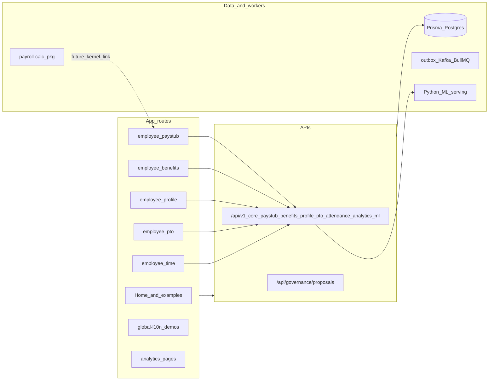

# Codebase completion — baseline and measurement

**Purpose:** Define how to answer “what percent complete?” without inventing a single orphan number. Aligns with the PO operating model (Feature briefs + numbered UAC).

**Last inventory:** 2026-05-18 (Features **001**–**021** shipped; Track A **147/147** UAC)

**Shippable vs platform:** **Track A (Feature UAC)** is the authoritative bar for “product shipped.” Routes, demos, kernels, and docs in tree that are **not** tied to an approved Feature brief’s numbered UAC count as **platform / scaffold / demo** capability — useful, but not closure of PO scope.

---

## 1. Denominators (pick one per report)

| Track | Denominator | Formula | When to use |
| --- | --- | --- | --- |
| **A — Feature UAC** | Sum of numbered UAC rows across approved Feature briefs under [`feature-briefs/`](./feature-briefs/) | `% = (UAC met ÷ UAC total) × 100`; optional **partial = 0.5** if explicitly scored | Shippable HR product progress; primary signal for this repo |
| **B — Phase architecture** | Checklist items you choose (e.g. [`docs/architecture/01-phase-a-core-boundaries.md`](../architecture/01-phase-a-core-boundaries.md)) | Manual count of satisfied items | Platform / “Phase A” readiness, not employee features |
| **C — AI platform** | Phases in [`docs/ml/implementation-sequence.md`](../ml/implementation-sequence.md) | Qualitative per phase (exit criteria met Y/N) | Inference / scoring / agents only |

**Do not use:** LOC, file counts, or vague “ERP parity” without a written backlog — they do not measure shippable value.

**Whole-repo single %:** Undefined unless you merge tracks with explicit weights (e.g. “70% weight on UAC track A, 30% on track B”). Document weights in PR or release notes if you publish a blended score.

---

## 2. Current portfolio (denominator A)

| Source | Count |
| --- | ---: |
| Feature briefs in `docs/product/feature-briefs/` | **21** (**001**–**021**) |
| Total numbered UAC (sum across briefs **001**–**013**, audited) | **85** |
| Shipped / verified UAC (audited **001**–**013**) | **85** / **85** |
| Shipped / verified UAC (audited **014**–**017**) | **30** / **30** |
| Shipped / verified UAC (audited **018**–**021**, Phase B) | **32** / **32** |
| **Cumulative Track A** | **147** / **147** |

Per brief UAC counts: **001**–**005** — 6 each · **006**–**010** — 6 each · **011** — 12 · **012** — 6 · **013** — 7.

Wave **001**–**005** audits: **§3**–**§3e** below. Wave **006**–**013** audits: [`completion-audits/features-006-013.md`](./completion-audits/features-006-013.md).  
Wave **014**–**017** audits: [`completion-audits/features-014-017.md`](./completion-audits/features-014-017.md).

**Primary product gap (prioritization):** Track A **001**–**021** closed (**147/147** UAC) including Phase B in-house payroll close. **North star:** [BambooHR + separate payroll](./goal-beat-bamboohr-plus-payroll-stack.md) — Phase B **exit** for reference customers; Phase C (connector catalog) remains deferred. Platform: [`deferred-platform-track.md`](./deferred-platform-track.md).

---

## 2a. Canonical “agent skills” for roadmap and gap analysis

When mapping **“implemented vs still needed”** to Cursor agent guidance **for this repository**, use the **revamped project skills** in [`.cursor/skills/`](../../.cursor/skills/) (`hr-product-gate`, `hr-domain-boundaries`, `hr-data-custody`, `hr-regulated-domain`, `hr-product-mcp-governance`, `hr-quality-lab`, `hr-swarm-governance`, `hr-orchestration-lanes`). Legacy names live under `_archived/2026-05-28-revamp/`.

Those skills are **orchestration and quality gates**, not interchangeable with the long **global Cursor marketplace / plugin skill list** (e.g. Vercel, Azure, Neon): the latter supports tooling choices; it does **not** substitute for the repo skill set above when sequencing HR ERP work.

---

## 2b. Orchestration bundles (conditional skills)

Delegates and PR authors should attach skills per [`.cursor/rules/orchestrator.mdc`](../../.cursor/rules/orchestrator.mdc). For **payroll math, wage/hour matrices, Compliance packs, or `docs/compliance/`** — **`@hr-regulated-domain`** (+ **agent-legal-hr-compliance**). For **`packages/payroll-calc/`** — same skill (payroll L3). For **employee-facing churn/screening/scoring**, **`docs/ai-governance/`**, **`lib/governance/`** — **`@hr-regulated-domain`**. For **in-app copilot MCP** (`lib/copilot/`, catalog, transport) — **`@hr-product-mcp-governance`** + **`ai_governance_reviewer`** lane; for **inference routing/drift** without copilot — **`@hr-regulated-domain`** mlops L3 + **`mlops_reviewer`**.

---

## 2c. Implemented capabilities today (engineering / platform inventory)

Point-in-time inventory of what exists **in-repo** beneath track A — UAC closure in **§3**–**§3e** and [`completion-audits/features-006-013.md`](./completion-audits/features-006-013.md).

### Web application (Next.js App Router)

- **Home:** [`src/app/page.tsx`](../../src/app/page.tsx) — employee CTAs (**001**–**007**, **009**–**010**, **012**), manager/HR links for **008** and Feature **011** bundle (team leave, punch corrections, review queue, onboarding templates, tax docs, org context, separation).
- **Employee profile:** [`src/app/employee/profile/page.tsx`](../../src/app/employee/profile/page.tsx) — HR profile read / guarded self-update (`EmployeeProfileClient`).
- **Employee benefits:** [`src/app/employee/benefits/page.tsx`](../../src/app/employee/benefits/page.tsx) — enrollment summary (`BenefitsClient`).
- **Employee PTO:** [`src/app/employee/pto/page.tsx`](../../src/app/employee/pto/page.tsx) — read-only balance + recorded dates (`PtoClient`).
- **Employee paystub:** [`src/app/employee/paystub/page.tsx`](../../src/app/employee/paystub/page.tsx) — current earnings statement UI (`PaystubClient`).
- **Employee time / clock:** [`src/app/employee/time/page.tsx`](../../src/app/employee/time/page.tsx) — today’s punches + clock-in (`TimeAttendanceClient`).
- **Examples:** [`src/app/examples/`](../../src/app/examples/) — jurisdiction, onboarding, org, reporting.
- **QA lab:** [`src/app/qa-lab/page.tsx`](../../src/app/qa-lab/page.tsx).
- **Global L10n lab:** [`src/app/global-l10n/`](../../src/app/global-l10n/) — payroll splits (contractor-style demo), scheduling overlap, profile, planning/sprint capacity–adjacent demos.
- **Analytics pages:** [`src/app/analytics/churn/page.tsx`](../../src/app/analytics/churn/page.tsx), [`skills/page.tsx`](../../src/app/analytics/skills/page.tsx), [`benchmarks/page.tsx`](../../src/app/analytics/benchmarks/page.tsx) — manager-style views (`ChurnScore`, etc.).

### Versioned HTTP API (`/api/v1/*`)

Registered in [`lib/security/route-policies.ts`](../../lib/security/route-policies.ts); handlers under [`src/app/api/v1/`](../../src/app/api/v1/).

| Area | Routes |
| --- | --- |
| Core HR-ish | `GET /employees`, `GET /employees/:employeeId` |
| Paystub (self) | `GET /me/paystub/current` |
| Benefits (self) | `GET /me/benefits/summary` |
| PTO (self) | `GET /me/pto/summary` |
| Profile (self) | `GET /me/profile`, `PATCH /me/profile` |
| Attendance (self) | `GET /me/attendance/today`, `POST /attendance/clock-in` |
| Analytics | `GET /analytics/churn`, `GET /analytics/skills/match`, `GET /analytics/benchmarks` |
| ML proxy | `POST /ml/churn/score` → `ML_SERVING_URL` (default `http://127.0.0.1:8090`) |

Other surfaces (not all in route-policies): [`src/app/api/governance/proposals`](../../src/app/api/governance/proposals/route.ts) (and execute/detail variants), [`src/app/api/global-l10n/`](../../src/app/api/global-l10n/), [`src/app/api/mock/`](../../src/app/api/mock/).

### Data and payroll math

- **Prisma app DB:** [`prisma/schema.prisma`](../../prisma/schema.prisma) — tenants, employees (**preferred name**, mailing address, personal email, phone, emergency contact columns — Feature **004**), churn scores, payroll period / payout lines, **`BenefitEnrollment`** (Feature **003**), **`PtoBalance`** / **`PtoRequest`** (Feature **005** demo seed rows), etc.
- **Payroll kernel package:** [`packages/payroll-calc/`](../../packages/payroll-calc/) — deterministic pipeline + tests; pay runs via [`lib/payroll/run-payroll.ts`](../../lib/payroll/run-payroll.ts) persist kernel output to `PaymentInstruction` / `PayoutLine`; paystub UI reads those rows. **Statutory** tables remain placeholders — see [`docs/compliance/us-federal-withholding-placeholder.md`](../compliance/us-federal-withholding-placeholder.md).

### Security and platform

- **Auth / policies / RLS-oriented path:** [`middleware.ts`](../../middleware.ts), [`lib/security/`](../../lib/security/), httpOnly session ([`lib/auth/session-cookie.ts`](../../lib/auth/session-cookie.ts)), OIDC login/callback ([`src/app/api/auth/oidc/`](../../src/app/api/auth/oidc/)), employee UI [`useHrAccess`](../../src/lib/auth/use-hr-access.ts).
- **Workers:** outbox → Kafka publisher, BullMQ integration jobs ([`README.md`](../../README.md)).
- **Contracts:** [`contracts/openapi/`](../../contracts/openapi/), [`proto/`](../../proto/).
- **Python sidecar:** training / ETL / churn FastAPI — [`services/`](../../services/) (“Predictive HR” in README).

### Documentation (substantive; not all mirrored in product UI)

- Compliance: [`docs/compliance/`](../compliance/).
- AI governance: [`docs/ai-governance/`](../ai-governance/).
- ML rollout phases: [`docs/ml/implementation-sequence.md`](../ml/implementation-sequence.md).
- Phase topology ADR: [`specs/alignment/decisions/0001-phase1-scope.md`](../../specs/alignment/decisions/0001-phase1-scope.md) — single app + Postgres; Kafka/multi-DB deferred until ADR revisit.

### High-level map (capabilities, not bounded-context deployment)

---

## 2d. Repo agent skills — gap lens versus inventory above

Skills live under [`.cursor/skills/*/SKILL.md`](../../.cursor/skills/). They are **orchestration lenses** applied when touching certain paths — not a second product backlog. “Still needed” means the skill stays relevant because the domain is **partially implemented** or **thin** versus production intent.

| Skill | Role | Present in codebase | Typical remaining work |
| --- | --- | --- | --- |
| [`hr-product-gate`](../../.cursor/skills/hr-product-gate/SKILL.md) | Briefs + UAC + friction | Briefs **001–013** audited | Author brief **014+** for net-new slices |
| [`hr-domain-boundaries`](../../.cursor/skills/hr-domain-boundaries/SKILL.md) | Contexts, buses, contracts | Phase 1 ADR + logical separation | Kafka/outbox extraction when ADR triggers |
| [`hr-regulated-domain`](../../.cursor/skills/hr-regulated-domain/SKILL.md) | Pay/compliance/AI L3 | Strong **docs**; payroll-calc; governance APIs | Premium/OT rules; production scoring checklist |
| [`hr-product-mcp-governance`](../../.cursor/skills/hr-product-mcp-governance/SKILL.md) | Copilot MCP catalog/transport | Catalog in `lib/copilot/mcp-tools.ts`; Cedar shadow config | Phase 3 transport + enforce per [`implementation-sequence.md`](../ml/implementation-sequence.md) |
| [`hr-data-custody`](../../.cursor/skills/hr-data-custody/SKILL.md) | Safe DDL, verify, OCI | Migrations + runbooks + GHCR | Applies on every schema change |
| [`hr-quality-lab`](../../.cursor/skills/hr-quality-lab/SKILL.md) | Layered tests | Playwright **001–010** + CI JWT mint | Expand integration DB suites per new briefs |
| [`hr-swarm-governance`](../../.cursor/skills/hr-swarm-governance/SKILL.md) | FinOps, post-mortems, contributor UX | Orchestration templates | Multi-agent cost discipline |

The long global **Cursor marketplace** skill list does **not** replace the revamped project skill set for HR ERP sequencing (see **§2a**).

---

## 2e. Primary product backlog (track A recap)

**Features 001–013** are **closed** against numbered UAC (85/85) — see **§3**–**§3e** and [`completion-audits/features-006-013.md`](./completion-audits/features-006-013.md).

**Next:** Implement Feature briefs **014**–**017**; platform deferrals reaffirmed in [`deferred-platform-track.md`](./deferred-platform-track.md) (2026-05-18 gap analysis).

---

## 3. Feature 001 audit — Employee paystub self-service

**Brief:** [`001-employee-paystub-self-service.md`](./feature-briefs/001-employee-paystub-self-service.md)  
**Method:** Codebase verification (routes, API, UI, seed data path, tests). Apply migrations (`20260509180000_paystub_payout_line_types`) and run [`scripts/seed-predictive-demo.ts`](../../scripts/seed-predictive-demo.ts) for demo **PaymentInstruction** rows.

**Primary UX term:** **Earnings statement** (navigation link label + page headings).

### UAC results

| # | UAC (summary) | Status | Evidence |
| --- | --- | --- | --- |
| 1 | ≤2 intentional navigational actions after auth from default home/dashboard to current paystub | **Met** | Home → **Earnings statement** link ([`src/app/page.tsx`](../../src/app/page.tsx)) → [`/employee/paystub`](../../src/app/employee/paystub/page.tsx) (one intentional navigational action from home). |
| 2 | Pay period dates, gross, itemized pre-tax deductions, taxes, net pay; standard terminology | **Met** | [`PaystubClient`](../../src/app/employee/paystub/paystub-client.tsx) + [`GET /api/v1/me/paystub/current`](../../src/app/api/v1/me/paystub/current/route.ts) + [`lib/paystub/get-current-paystub.ts`](../../lib/paystub/get-current-paystub.ts) (`formatMoneyMinor`, section labels **Earnings**, **Pre-tax deductions**, **Taxes**, **Gross pay**, **Net pay**). |
| 3 | Dedicated empty state when no paystub exists | **Met** | **No paystub yet** card when API returns `paystub: null` ([`paystub-client.tsx`](../../src/app/employee/paystub/paystub-client.tsx)). |
| 4 | Recoverable error on load failure; no stack traces/error codes for employee | **Met** | Recoverable / auth copy without exposing API codes; dedicated [`employee/paystub/error.tsx`](../../src/app/employee/paystub/error.tsx) boundary (no dev diagnostics block). |
| 5 | Consistent **paystub** or **earnings statement** in nav and headings | **Met** | Home link **Earnings statement**; page `<h1>` + card titles use **Earnings statement** / **Current earnings statement**. |
| 6 | First-time path under 10 seconds (QA script, excl. external network) | **Met** | Playwright timed scenario [`tests/e2e/paystub-feature-001.spec.ts`](../../tests/e2e/paystub-feature-001.spec.ts) with `HR_ERP_PAYSTUB_E2E_JWT`; Vitest coverage for totals [`tests/paystub-totals.test.ts`](../../tests/paystub-totals.test.ts). |

**Supporting note:** Demo payroll rows seeded on predictive HR seed for Jordan Chen (`DEMO_PAYSTUB_EMPLOYEE_ID` / default `b0000001-0001-4000-8000-000000000011`). Issue JWT: `DEV_ROLES=employee` + `DEV_SUBJECT_EMPLOYEE_ID` + `DEV_TENANT_ID` matching demo org — [`scripts/issue-dev-jwt.mjs`](../../scripts/issue-dev-jwt.mjs).

### Feature 001 score (track A only)

- **Met:** 6  
- **Partial:** 0  
- **Total UAC:** 6  
- **Completion:** **100%** for Feature **001** as of inventory date.

---

## 3b. Feature 002 audit — Time & attendance (clock confirmation)

**Brief:** [`002-time-attendance-self-service.md`](./feature-briefs/002-time-attendance-self-service.md)  
**Method:** Codebase verification (routes, API, UI, tests). Uses existing `AttendancePunch` rows scoped to the employee’s **calendar day** in [`inferAttendanceTimeZone`](../../lib/attendance/infer-attendance-timezone.ts) (work context `primary_timezone`, else `DE` → `Europe/Berlin`, else UTC).

**Primary UX term:** **Time** (nav + `<h1>`); subtitle **Clock** ([`src/app/employee/time/page.tsx`](../../src/app/employee/time/page.tsx)).

### UAC results

| # | UAC (summary) | Status | Evidence |
| --- | --- | --- | --- |
| 1 | ≤2 navigational actions from default home to today’s attendance summary | **Met** | Home → **Time** ([`src/app/page.tsx`](../../src/app/page.tsx)) → [`/employee/time`](../../src/app/employee/time/page.tsx). |
| 2 | Shows active clock-in vs not clocked in with standard wording | **Met** | [`TimeAttendanceClient`](../../src/app/employee/time/time-attendance-client.tsx) status card + [`deriveClockedIn`](../../lib/attendance/punch-summary.ts) on [`GET /api/v1/me/attendance/today`](../../src/app/api/v1/me/attendance/today/route.ts). |
| 3 | Dedicated empty state when no punches today | **Met** | **No punches yet today** dashed card when `punches.length === 0`. |
| 4 | Recoverable load errors; no stack traces / codes for employee | **Met** | Retry copy + [`employee/time/error.tsx`](../../src/app/employee/time/error.tsx); clock-in maps `already_clocked_in` internally to plain language only. |
| 5 | Consistent **Time** / **Attendance** term | **Met** | **Time** used consistently per brief Notes + heading pattern **Time · Clock**. |
| 6 | Task-time target (&lt; 1 min) via QA script | **Met** | Playwright [`tests/e2e/time-attendance-feature-002.spec.ts`](../../tests/e2e/time-attendance-feature-002.spec.ts) (`HR_ERP_TIME_E2E_JWT`); Vitest [`tests/attendance-punch-summary.test.ts`](../../tests/attendance-punch-summary.test.ts), [`tests/zoned-calendar-day.test.ts`](../../tests/zoned-calendar-day.test.ts), [`tests/infer-attendance-timezone.test.ts`](../../tests/infer-attendance-timezone.test.ts). |

### Feature 002 score (track A only)

- **Met:** 6  
- **Partial:** 0  
- **Total UAC:** 6  
- **Completion:** **100%** for Feature **002** as of inventory date.

---

## 3c. Feature 003 audit — Benefits enrollment summary

**Brief:** [`003-benefits-enrollment-summary.md`](./feature-briefs/003-benefits-enrollment-summary.md)  
**Method:** Codebase verification (routes, API, UI, Prisma `BenefitEnrollment`, seed, tests). Apply migration [`20260509200000_benefit_enrollments`](../../prisma/migrations/20260509200000_benefit_enrollments/migration.sql) and run [`scripts/seed-predictive-demo.ts`](../../scripts/seed-predictive-demo.ts) for demo enrollment rows on Jordan (`DEMO_PAYSTUB_EMPLOYEE_ID` default).

**Primary UX term:** **Benefits** (home link + page eyebrow); enrollment detail heading **Your enrollments** ([`src/app/employee/benefits/page.tsx`](../../src/app/employee/benefits/page.tsx)). QA documents **Benefits** as the employee-facing term (not **Coverage**).

### UAC results

| # | UAC (summary) | Status | Evidence |
| --- | --- | --- | --- |
| 1 | ≤2 navigational actions from default landing to current benefits summary | **Met** | Home → **Benefits** ([`src/app/page.tsx`](../../src/app/page.tsx)) → [`/employee/benefits`](../../src/app/employee/benefits/page.tsx). |
| 2 | Lists active enrollments with human-readable plan/tier labels | **Met** | [`BenefitsClient`](../../src/app/employee/benefits/benefits-client.tsx) sections + [`GET /api/v1/me/benefits/summary`](../../src/app/api/v1/me/benefits/summary/route.ts) + [`lib/benefits/get-benefits-summary.ts`](../../lib/benefits/get-benefits-summary.ts) (`planLabel`, grouped categories). |
| 3 | Effective dates visible per enrollment | **Met** | **Effective:** range with medium date formatting + **ongoing** when `effectiveTo` is null. |
| 4 | Dedicated empty state when no enrollments | **Met** | **No enrollments on file** card with Benefits-contact guidance ([`benefits-client.tsx`](../../src/app/employee/benefits/benefits-client.tsx)). |
| 5 | Load failures — plain-language retry; no stack traces or internal codes | **Met** | Retry + auth copy; [`employee/benefits/error.tsx`](../../src/app/employee/benefits/error.tsx). |
| 6 | Consistent benefits wording for nav / QA | **Met** | Home **Benefits**; primary term documented here (**Benefits**); Playwright [`tests/e2e/benefits-feature-003.spec.ts`](../../tests/e2e/benefits-feature-003.spec.ts) (`HR_ERP_BENEFITS_E2E_JWT`); Vitest [`tests/benefits-is-benefit-enrollment-active.test.ts`](../../tests/benefits-is-benefit-enrollment-active.test.ts). |

### Feature 003 score (track A only)

- **Met:** 6  
- **Partial:** 0  
- **Total UAC:** 6  
- **Completion:** **100%** for Feature **003** as of inventory date.

---

## 3d. Feature 004 audit — Employee profile & contact self-service

**Brief:** [`004-core-hr-employee-profile-self-service.md`](./feature-briefs/004-core-hr-employee-profile-self-service.md)  
**Method:** Codebase verification (routes, API, UI, Prisma columns on `employees`, seed, tests). Apply migration [`20260509204500_employee_profile_contact_fields`](../../prisma/migrations/20260509204500_employee_profile_contact_fields/migration.sql); demo profile slice on Jordan via [`scripts/seed-predictive-demo.ts`](../../scripts/seed-predictive-demo.ts).

**Primary UX term:** **My profile** (home link + `<h1>`); eyebrow **Core HR** ([`src/app/employee/profile/page.tsx`](../../src/app/employee/profile/page.tsx)).

### UAC results

| # | UAC (summary) | Status | Evidence |
| --- | --- | --- | --- |
| 1 | ≤2 navigational actions from default landing to profile | **Met** | Home → **My profile** ([`src/app/page.tsx`](../../src/app/page.tsx)) → [`/employee/profile`](../../src/app/employee/profile/page.tsx). |
| 2 | Shows legal name, preferred name, work/personal email, phone, mailing address with HR terminology | **Met** | [`EmployeeProfileClient`](../../src/app/employee/profile/profile-client.tsx) + [`GET /api/v1/me/profile`](../../src/app/api/v1/me/profile/route.ts) / [`lib/profile/get-my-profile.ts`](../../lib/profile/get-my-profile.ts). |
| 3 | Non-editable fields marked HR-maintained — no fake edit controls | **Met** | Legal names + work email use disabled/read-only inputs + **Maintained by HR** copy; editable fields are normal inputs. Server exposes authoritative [`fieldPolicy`](../../lib/profile/profile-field-policy.ts) on API responses. |
| 4 | Save confirmation plain-language; failures retry guidance — no stacks/codes in UI | **Met** | Success status banner; save/load retry copy without surfacing API codes ([`profile-client.tsx`](../../src/app/employee/profile/profile-client.tsx)); PATCH validation mapped to generic employee-safe [`invalid_profile_update`](../../src/app/api/v1/me/profile/route.ts). |
| 5 | Emergency contact section + supportive empty state | **Met** | Dedicated card + dashed guidance when unset ([`profile-client.tsx`](../../src/app/employee/profile/profile-client.tsx)). |
| 6 | Profile review task-time target via QA script (&lt; 90s) | **Met** | Playwright [`tests/e2e/profile-feature-004.spec.ts`](../../tests/e2e/profile-feature-004.spec.ts) (`HR_ERP_PROFILE_E2E_JWT`); Vitest [`tests/profile-patch-schema.test.ts`](../../tests/profile-patch-schema.test.ts). |

### Feature 004 score (track A only)

- **Met:** 6  
- **Partial:** 0  
- **Total UAC:** 6  
- **Completion:** **100%** for Feature **004** as of inventory date.

---

## 3e. Feature 005 audit — PTO balance & recorded time off

**Brief:** [`005-pto-leave-self-service.md`](./feature-briefs/005-pto-leave-self-service.md)  
**Method:** Codebase verification (routes, API, UI, Prisma `PtoBalance` / `PtoRequest`, seed, tests). Run [`scripts/seed-predictive-demo.ts`](../../scripts/seed-predictive-demo.ts) for demo balance + Jordan **recorded** dates (`DEMO_PAYSTUB_EMPLOYEE_ID` default).

**Primary UX term:** **PTO** (home link); page `<h1>` **Your PTO** with eyebrow **Time off** ([`src/app/employee/pto/page.tsx`](../../src/app/employee/pto/page.tsx)).

### UAC results

| # | UAC (summary) | Status | Evidence |
| --- | --- | --- | --- |
| 1 | ≤2 navigational actions from default landing to PTO summary | **Met** | Home → **PTO** ([`src/app/page.tsx`](../../src/app/page.tsx)) → [`/employee/pto`](../../src/app/employee/pto/page.tsx). |
| 2 | Balance in hours + plain-language **as-of** date when a row exists | **Met** | [`PtoClient`](../../src/app/employee/pto/pto-client.tsx) + [`GET /api/v1/me/pto/summary`](../../src/app/api/v1/me/pto/summary/route.ts) + [`lib/pto/get-pto-summary.ts`](../../lib/pto/get-pto-summary.ts) (`formatBalanceHoursDisplay`, **Balance as of …**). |
| 3 | Recent recorded time-off dates, newest first, human-readable | **Met** | API orders `requestDate` desc; UI lists medium-formatted calendar days ([`pto-client.tsx`](../../src/app/employee/pto/pto-client.tsx)). |
| 4 | Dedicated empty state when no balance and no dates | **Met** | **No PTO data on file yet** card ([`pto-client.tsx`](../../src/app/employee/pto/pto-client.tsx)). |
| 5 | Recoverable load failures — no stacks/codes for employee | **Met** | Retry + auth copy ([`pto-client.tsx`](../../src/app/employee/pto/pto-client.tsx)); [`employee/pto/error.tsx`](../../src/app/employee/pto/error.tsx). |
| 6 | **PTO** wording + timed QA (&lt; 60s scan balance + recent sections) | **Met** | Playwright [`tests/e2e/pto-feature-005.spec.ts`](../../tests/e2e/pto-feature-005.spec.ts) (`HR_ERP_PTO_E2E_JWT`); Vitest [`tests/pto-format-balance-hours.test.ts`](../../tests/pto-format-balance-hours.test.ts). |

### Feature 005 score (track A only)

- **Met:** 6  
- **Partial:** 0  
- **Total UAC:** 6  
- **Completion:** **100%** for Feature **005** as of inventory date.

---

## 4. Maintainer hygiene

When adding a Feature brief:

1. Increment portfolio counts in **§2** (or generate from briefs).
2. After implementation claims merge readiness, attach a filled QA plan tied to verbatim UAC ([`specs/templates/qa-plan.md`](../../specs/templates/qa-plan.md)) and update the Feature’s row in §3 or a sibling `completion-audits/` note.
