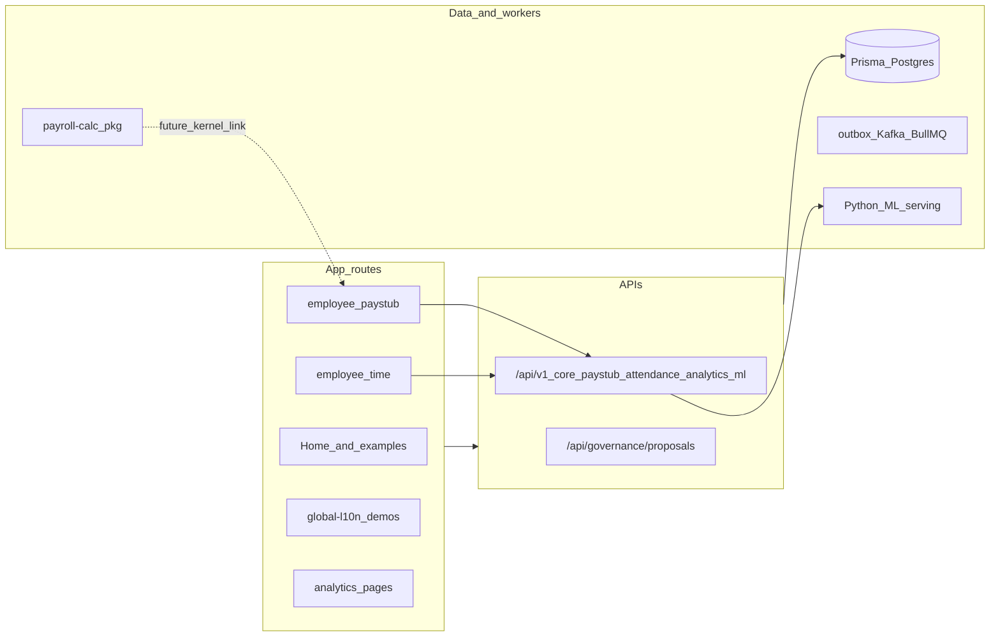

# Codebase completion — baseline and measurement

**Purpose:** Define how to answer “what percent complete?” without inventing a single orphan number. Aligns with the PO operating model (Feature briefs + numbered UAC).

**Last inventory:** 2026-05-09 (Features **001** and **002** implementation verified in codebase)

**Shippable vs platform:** **Track A (Feature UAC)** is the authoritative bar for “product shipped.” Routes, demos, kernels, and docs in tree that are **not** tied to an approved Feature brief’s numbered UAC count as **platform / scaffold / demo** capability — useful, but not closure of PO scope.

---

## 1. Denominators (pick one per report)

| Track | Denominator | Formula | When to use |
| --- | --- | --- | --- |
| **A — Feature UAC** | Sum of numbered UAC rows across approved Feature briefs under [`feature-briefs/`](./feature-briefs/) | `% = (UAC met ÷ UAC total) × 100`; optional **partial = 0.5** if explicitly scored | Shippable HR product progress; primary signal for this repo |
| **B — Phase architecture** | Checklist items you choose (e.g. [`docs/architecture/01-phase-a-core-boundaries.md`](../architecture/01-phase-a-core-boundaries.md)) | Manual count of satisfied items | Platform / “Phase A” readiness, not employee features |
| **C — AI platform** | Phases in [`docs/ml/implementation-sequence.md`](../ml/implementation-sequence.md) | Qualitative per phase (exit criteria met Y/N) | Inference / scoring / agents only |

**Do not use:** LOC, file counts, or vague “ERP parity” without a written backlog — they do not measure shippable value.

**Whole-repo single %:** Undefined unless you merge tracks with explicit weights (e.g. “70% weight on UAC track A, 30% on track B”). Document weights in PR or release notes if you publish a blended score.

---

## 2. Current portfolio (denominator A)

| Source | Count |
| --- | ---: |
| Feature briefs in `docs/product/feature-briefs/` | **4** |
| Total numbered UAC (sum across briefs 001–004) | **24** |

Shipped / verified UAC to date: Feature **001** — **6** / 6 · Feature **002** — **6** / 6 · Features **003–004** — not implemented.

Per brief UAC counts: **001** — 6 · **002** — 6 · **003** — 6 · **004** — 6.

As briefs are added, update this table or derive counts from briefs in CI/docs automation later.

**Primary product gap (prioritization):** **[Feature 003](./feature-briefs/003-benefits-enrollment-summary.md)** then **[004](./feature-briefs/004-core-hr-employee-profile-self-service.md)** as prioritized; **001–002** closed per **§3** / **§3b**.

---

## 2a. Canonical “agent skills” for roadmap and gap analysis

When mapping **“implemented vs still needed”** to Cursor agent guidance **for this repository**, use the **HR ERP skills** shipped in [`.cursor/skills/`](../../.cursor/skills/) (15 `SKILL.md` folders: `hr-product-owner`, `hr-erp-principal-architecture`, `hr-erp-innovation-rd`, `hr-backend-compliance`, `hr-payroll-calculation-engine`, `hr-ai-data-governance`, `hr-erp-mlops`, `hr-erp-security-identity`, `hr-erp-qa-chaos`, `hr-db-migration-state`, `hr-code-health`, `hr-erp-packaging-supply-chain`, `hr-developer-advocate`, `hr-erp-finops-swarm`, `hr-erp-collaboration-audit`).

Those skills are **orchestration and quality gates**, not interchangeable with the long **global Cursor marketplace / plugin skill list** (e.g. Vercel, Azure, Neon): the latter supports tooling choices; it does **not** substitute for the repo skill set above when sequencing HR ERP work.

---

## 2b. Orchestration bundles (conditional skills)

Delegates and PR authors should attach skills per [`.cursor/rules/orchestrator.mdc`](../../.cursor/rules/orchestrator.mdc). For **payroll math, wage/hour matrices, Compliance packs, or `docs/compliance/`** implementations, bind **`hr-backend-compliance`** (+ **agent-legal-hr-compliance** on Tasks); for **`packages/payroll-calc/`**, gross-to-net, fingerprints, **`computePayroll`**, also bind **`hr-payroll-calculation-engine`**. For **employee-facing churn/screening/scoring** or **`docs/ai-governance/`**, **`lib/governance/`**, governance APIs — bind **`hr-ai-data-governance`**; co-load **`hr-erp-mlops`** when inference routing, drift, MCP, or model serving materially changes.

---

## 2c. Implemented capabilities today (engineering / platform inventory)

Point-in-time inventory of what exists **in-repo** beneath track A — individual brief UAC closure is tracked in **§3** (Features **001**–**002**) and future audits.

### Web application (Next.js App Router)

- **Home:** [`src/app/page.tsx`](../../src/app/page.tsx) — primary CTAs **Time** (Feature **002**) and **Earnings statement** (Feature **001**) plus examples / QA lab.
- **Employee paystub:** [`src/app/employee/paystub/page.tsx`](../../src/app/employee/paystub/page.tsx) — current earnings statement UI (`PaystubClient`).
- **Employee time / clock:** [`src/app/employee/time/page.tsx`](../../src/app/employee/time/page.tsx) — today’s punches + clock-in (`TimeAttendanceClient`).
- **Examples:** [`src/app/examples/`](../../src/app/examples/) — jurisdiction, onboarding, org, reporting.
- **QA lab:** [`src/app/qa-lab/page.tsx`](../../src/app/qa-lab/page.tsx).
- **Global L10n lab:** [`src/app/global-l10n/`](../../src/app/global-l10n/) — payroll splits (contractor-style demo), scheduling overlap, profile, planning/sprint capacity–adjacent demos.
- **Analytics pages:** [`src/app/analytics/churn/page.tsx`](../../src/app/analytics/churn/page.tsx), [`skills/page.tsx`](../../src/app/analytics/skills/page.tsx), [`benchmarks/page.tsx`](../../src/app/analytics/benchmarks/page.tsx) — manager-style views (`ChurnScore`, etc.).

### Versioned HTTP API (`/api/v1/*`)

Registered in [`lib/security/route-policies.ts`](../../lib/security/route-policies.ts); handlers under [`src/app/api/v1/`](../../src/app/api/v1/).

| Area | Routes |
| --- | --- |
| Core HR-ish | `GET /employees`, `GET /employees/:employeeId` |
| Paystub (self) | `GET /me/paystub/current` |
| Attendance (self) | `GET /me/attendance/today`, `POST /attendance/clock-in` |
| Analytics | `GET /analytics/churn`, `GET /analytics/skills/match`, `GET /analytics/benchmarks` |
| ML proxy | `POST /ml/churn/score` → `ML_SERVING_URL` (default `http://127.0.0.1:8090`) |

Other surfaces (not all in route-policies): [`src/app/api/governance/proposals`](../../src/app/api/governance/proposals/route.ts) (and execute/detail variants), [`src/app/api/global-l10n/`](../../src/app/api/global-l10n/), [`src/app/api/mock/`](../../src/app/api/mock/).

### Data and payroll math

- **Prisma app DB:** [`prisma/schema.prisma`](../../prisma/schema.prisma) — tenants, employees, churn scores, payroll period / payout lines (`PRE_TAX_DEDUCTION`, `TAX_WITHHOLDING` for earnings statements), etc.
- **Payroll kernel package:** [`packages/payroll-calc/`](../../packages/payroll-calc/) — deterministic pipeline + tests; **not yet** the sole source for paystub lines (employee statement reads persisted `PaymentInstruction` / `PayoutLine`; kernel integration remains a future enhancement).

### Security and platform

- **Auth / policies / RLS-oriented path:** [`middleware.ts`](../../middleware.ts), [`lib/security/`](../../lib/security/).
- **Workers:** outbox → Kafka publisher, BullMQ integration jobs ([`README.md`](../../README.md)).
- **Contracts:** [`contracts/openapi/`](../../contracts/openapi/), [`proto/`](../../proto/).
- **Python sidecar:** training / ETL / churn FastAPI — [`services/`](../../services/) (“Predictive HR” in README).

### Documentation (substantive; not all mirrored in product UI)

- Compliance: [`docs/compliance/`](../compliance/).
- AI governance: [`docs/ai-governance/`](../ai-governance/).
- ML rollout phases: [`docs/ml/implementation-sequence.md`](../ml/implementation-sequence.md).
- Phase topology ADR: [`specs/alignment/decisions/0001-phase1-scope.md`](../../specs/alignment/decisions/0001-phase1-scope.md) — single app + Postgres; Kafka/multi-DB deferred until ADR revisit.

### High-level map (capabilities, not bounded-context deployment)

---

## 2d. Repo agent skills (15) — gap lens versus inventory above

Skills live under [`.cursor/skills/*/SKILL.md`](../../.cursor/skills/). They are **orchestration lenses** applied when touching certain paths — not a second product backlog. “Still needed” means the skill stays relevant because the domain is **partially implemented** or **thin** versus production intent.

| Skill | Role | Present in codebase | Typical remaining work |
| --- | --- | --- | --- |
| [`hr-product-owner`](../../.cursor/skills/hr-product-owner/SKILL.md) | Briefs + UAC + friction | Briefs **001–004** approved | Implement **003–004** UAC; maintain friction gates |
| [`hr-erp-principal-architecture`](../../.cursor/skills/hr-erp-principal-architecture/SKILL.md) | Contexts, buses, contracts | Phase 1 ADR + logical separation | Kafka/outbox extraction when ADR triggers |
| [`hr-erp-innovation-rd`](../../.cursor/skills/hr-erp-innovation-rd/SKILL.md) | Edge/pgvector/Wasm/Rust gates | Postgres-centered MVP | Parity notes when Edge-heavy paths land |
| [`hr-backend-compliance`](../../.cursor/skills/hr-backend-compliance/SKILL.md) | Wage/hour, `COMPLIANCE_*` | Strong **docs**; employee clock-in + **today summary** | Premium/OT + meal/break rules when briefs demand |
| [`hr-payroll-calculation-engine`](../../.cursor/skills/hr-payroll-calculation-engine/SKILL.md) | `packages/payroll-calc` | Package + tests | Optional: kernel output ↔ persisted paystub lines |
| [`hr-ai-data-governance`](../../.cursor/skills/hr-ai-data-governance/SKILL.md) | HITL, XAI, governance | Proposals APIs + churn surfaces | [`PR_CHECKLIST.md`](../ai-governance/PR_CHECKLIST.md) for production scoring |
| [`hr-erp-mlops`](../../.cursor/skills/hr-erp-mlops/SKILL.md) | Inference tiering, logs, drift | Churn proxy + doc sequence | Phases in [`implementation-sequence.md`](../ml/implementation-sequence.md) |
| [`hr-erp-security-identity`](../../.cursor/skills/hr-erp-security-identity/SKILL.md) | RBAC/ABAC, RLS, CI | Baseline wired | Cookie/session UX vs dev bearer for employee flows |
| [`hr-erp-qa-chaos`](../../.cursor/skills/hr-erp-qa-chaos/SKILL.md) | Layered tests | QA lab + [`docs/QA.md`](../QA.md) | Expand automated UAC coverage for **003–004** |
| [`hr-db-migration-state`](../../.cursor/skills/hr-db-migration-state/SKILL.md) | Safe DDL, verify | Migrations + runbooks | Applies on every schema change |
| [`hr-code-health`](../../.cursor/skills/hr-code-health/SKILL.md) | Smell/refactor hygiene | Process skill | Runs on substantive `src`/contract edits |
| [`hr-erp-packaging-supply-chain`](../../.cursor/skills/hr-erp-packaging-supply-chain/SKILL.md) | OCI, SBOM | CI + README | Operational release tuning |
| [`hr-developer-advocate`](../../.cursor/skills/hr-developer-advocate/SKILL.md) | Contributor UX | Templates | External PR/issue handoffs |
| [`hr-erp-finops-swarm`](../../.cursor/skills/hr-erp-finops-swarm/SKILL.md) | Multi-agent cost discipline | Orchestration-only | Not a product feature gap |
| [`hr-erp-collaboration-audit`](../../.cursor/skills/hr-erp-collaboration-audit/SKILL.md) | Post-mortems | Audit-only | Not a product feature gap |

The long global **Cursor marketplace** skill list does **not** replace the 15-repo set for HR ERP sequencing (see **§2a**).

---

## 2e. Primary product backlog (track A recap)

**Feature 001** and **Feature 002** are **closed** against numbered UAC — see **§3** and **§3b**.

**Next:** **[Feature 003](./feature-briefs/003-benefits-enrollment-summary.md)** (benefits summary), **[004](./feature-briefs/004-core-hr-employee-profile-self-service.md)** (profile self-service) — prioritize per PO; not implemented beyond brief approval.

---

## 3. Feature 001 audit — Employee paystub self-service

**Brief:** [`001-employee-paystub-self-service.md`](./feature-briefs/001-employee-paystub-self-service.md)  
**Method:** Codebase verification (routes, API, UI, seed data path, tests). Apply migrations (`20260509180000_paystub_payout_line_types`) and run [`scripts/seed-predictive-demo.ts`](../../scripts/seed-predictive-demo.ts) for demo **PaymentInstruction** rows.

**Primary UX term:** **Earnings statement** (navigation link label + page headings).

### UAC results

| # | UAC (summary) | Status | Evidence |
| --- | --- | --- | --- |
| 1 | ≤2 intentional navigational actions after auth from default home/dashboard to current paystub | **Met** | Home → **Earnings statement** link ([`src/app/page.tsx`](../../src/app/page.tsx)) → [`/employee/paystub`](../../src/app/employee/paystub/page.tsx) (one intentional navigational action from home). |
| 2 | Pay period dates, gross, itemized pre-tax deductions, taxes, net pay; standard terminology | **Met** | [`PaystubClient`](../../src/app/employee/paystub/paystub-client.tsx) + [`GET /api/v1/me/paystub/current`](../../src/app/api/v1/me/paystub/current/route.ts) + [`lib/paystub/get-current-paystub.ts`](../../lib/paystub/get-current-paystub.ts) (`formatMoneyMinor`, section labels **Earnings**, **Pre-tax deductions**, **Taxes**, **Gross pay**, **Net pay**). |
| 3 | Dedicated empty state when no paystub exists | **Met** | **No paystub yet** card when API returns `paystub: null` ([`paystub-client.tsx`](../../src/app/employee/paystub/paystub-client.tsx)). |
| 4 | Recoverable error on load failure; no stack traces/error codes for employee | **Met** | Recoverable / auth copy without exposing API codes; dedicated [`employee/paystub/error.tsx`](../../src/app/employee/paystub/error.tsx) boundary (no dev diagnostics block). |
| 5 | Consistent **paystub** or **earnings statement** in nav and headings | **Met** | Home link **Earnings statement**; page `<h1>` + card titles use **Earnings statement** / **Current earnings statement**. |
| 6 | First-time path under 10 seconds (QA script, excl. external network) | **Met** | Playwright timed scenario [`tests/e2e/paystub-feature-001.spec.ts`](../../tests/e2e/paystub-feature-001.spec.ts) with `HR_ERP_PAYSTUB_E2E_JWT`; Vitest coverage for totals [`tests/paystub-totals.test.ts`](../../tests/paystub-totals.test.ts). |

**Supporting note:** Demo payroll rows seeded on predictive HR seed for Jordan Chen (`DEMO_PAYSTUB_EMPLOYEE_ID` / default `b0000001-0001-4000-8000-000000000011`). Issue JWT: `DEV_ROLES=employee` + `DEV_SUBJECT_EMPLOYEE_ID` + `DEV_TENANT_ID` matching demo org — [`scripts/issue-dev-jwt.mjs`](../../scripts/issue-dev-jwt.mjs).

### Feature 001 score (track A only)

- **Met:** 6  
- **Partial:** 0  
- **Total UAC:** 6  
- **Completion:** **100%** for Feature **001** as of inventory date.

---

## 3b. Feature 002 audit — Time & attendance (clock confirmation)

**Brief:** [`002-time-attendance-self-service.md`](./feature-briefs/002-time-attendance-self-service.md)  
**Method:** Codebase verification (routes, API, UI, tests). Uses existing `AttendancePunch` rows scoped to the employee’s **calendar day** in [`inferAttendanceTimeZone`](../../lib/attendance/infer-attendance-timezone.ts) (work context `primary_timezone`, else `DE` → `Europe/Berlin`, else UTC).

**Primary UX term:** **Time** (nav + `<h1>`); subtitle **Clock** ([`src/app/employee/time/page.tsx`](../../src/app/employee/time/page.tsx)).

### UAC results

| # | UAC (summary) | Status | Evidence |
| --- | --- | --- | --- |
| 1 | ≤2 navigational actions from default home to today’s attendance summary | **Met** | Home → **Time** ([`src/app/page.tsx`](../../src/app/page.tsx)) → [`/employee/time`](../../src/app/employee/time/page.tsx). |
| 2 | Shows active clock-in vs not clocked in with standard wording | **Met** | [`TimeAttendanceClient`](../../src/app/employee/time/time-attendance-client.tsx) status card + [`deriveClockedIn`](../../lib/attendance/punch-summary.ts) on [`GET /api/v1/me/attendance/today`](../../src/app/api/v1/me/attendance/today/route.ts). |
| 3 | Dedicated empty state when no punches today | **Met** | **No punches yet today** dashed card when `punches.length === 0`. |
| 4 | Recoverable load errors; no stack traces / codes for employee | **Met** | Retry copy + [`employee/time/error.tsx`](../../src/app/employee/time/error.tsx); clock-in maps `already_clocked_in` internally to plain language only. |
| 5 | Consistent **Time** / **Attendance** term | **Met** | **Time** used consistently per brief Notes + heading pattern **Time · Clock**. |
| 6 | Task-time target (&lt; 1 min) via QA script | **Met** | Playwright [`tests/e2e/time-attendance-feature-002.spec.ts`](../../tests/e2e/time-attendance-feature-002.spec.ts) (`HR_ERP_TIME_E2E_JWT`); Vitest [`tests/attendance-punch-summary.test.ts`](../../tests/attendance-punch-summary.test.ts), [`tests/zoned-calendar-day.test.ts`](../../tests/zoned-calendar-day.test.ts), [`tests/infer-attendance-timezone.test.ts`](../../tests/infer-attendance-timezone.test.ts). |

### Feature 002 score (track A only)

- **Met:** 6  
- **Partial:** 0  
- **Total UAC:** 6  
- **Completion:** **100%** for Feature **002** as of inventory date.

---

## 4. Maintainer hygiene

When adding a Feature brief:

1. Increment portfolio counts in **§2** (or generate from briefs).
2. After implementation claims merge readiness, attach a filled QA plan tied to verbatim UAC ([`specs/templates/qa-plan.md`](../../specs/templates/qa-plan.md)) and update the Feature’s row in §3 or a sibling `completion-audits/` note.
