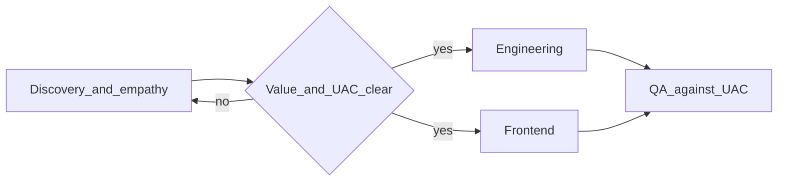

# HR Product Owner operating model

## Role: what “done” means before engineering

The Product Owner **does not write application code**. They own:

1. **Human reality & process mapping** — For each capability, spell out the real-world workflow, stress points, compliance touchpoints, and who does what (not “flip a flag in a table”).
2. **Prioritization** — Ship order is driven by **reduced clicks**, **no duplicate entry**, and **automation of mundane work**. “Cool” architecture or features that do not map to an HR pain point do not get scheduled.
3. **User acceptance criteria (UAC)** — Observable, testable behaviors phrased for QA. Language must match **standard HR terms** (e.g. Headcount reconciliation, FMLA, PIP, onboarding, offboarding, job architecture, paystub / earnings statement), not generic CRUD jargon.
4. **Friction police** — Any UI must be understandable without a manual. **Bar:** a typical employee task (e.g. “see my paystub”) is discoverable and completable in **under ~10 seconds** for a first-time user on a clean device; managers and HR get similarly low-friction paths for their top tasks.

## Gate: nothing goes to Engineering without proof of value

For each proposed feature, the PO **blocks** handoff until this is explicit:

- **User** — Which persona (HR director, new hire, frontline manager, etc.) and **primary job-to-be-done**.
- **Pain today** — What breaks, wastes time, or creates risk without this.
- **Outcome** — Measurable or clearly observable improvement (time saved, errors prevented, compliance step not skipped).
- **Scope boundary** — What is explicitly **out** of scope to avoid scope creep.

If those are weak or missing, the item stays in discovery; engineering agents should not start build work.

## Repeatable deliverable per feature

Use one short **Feature brief** per capability (see [feature-brief-template.md](feature-brief-template.md)) containing:

| Section | Purpose |
|--------|--------|
| **Empathy / process** | Narrative of the real workflow and sensitivity. |
| **Personas & scenarios** | 2–4 concrete scenarios (“Given… When… Then…” at story level). |
| **Prioritization rationale** | Tie to pain reduction; call out deferred “nice-to-haves.” |
| **UAC** | Numbered, strict checks QA can execute; use HR terminology. |
| **Friction checks** | Task-time targets, empty-state behavior, error messages a non-technical user can act on. |

Frontend receives **wireframe-level intent** or references plus the friction checks; QA copies **UAC verbatim** into test plans.

## How this interacts with agents

- **Engineering agents** — Receive only features that passed the gate, with UAC attached. They optimize for the brief, not for novelty.
- **QA agent** — Tests **only** against published UAC; gaps in UAC are PO defects, not “guess what we meant.”
- **Frontend agent** — Designs are rejected if they require training to understand primary flows; PO reopens with simpler IA, labeling, and defaults.

