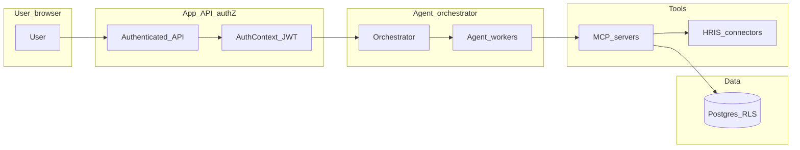

# Threat model: multi-tenant agents and MCP tooling

## Scope

This document covers **AI agents** (orchestrated LLM workflows) and **Model Context Protocol (MCP)** servers that expose tools (databases, HRIS APIs, document stores). It assumes a **multi-tenant** HR ERP where **cross-tenant data access** is the primary catastrophic failure mode.

Out of scope: model training supply-chain attacks (cover under separate ML security review).

## Assets

| Asset | Description |
|-------|-------------|
| **Tenant HR data** | Employees, payroll metadata, performance, benefits elections. |
| **Credentials** | OAuth tokens, API keys, short-lived service tokens for HRIS. |
| **Agent audit trail** | Who invoked which tool with what high-level intent. |
| **Model prompts** | May contain PII if not minimized. |

## Trust boundaries

**Invariant:** The **application auth plane** (`AuthContext`, JWT/mTLS) is the **only** source of tenant identity. Tool arguments or model-generated text **must not** override `tenant_id`, `subject_id`, or scope.

## Threats and mitigations

| ID | Threat | Example attack | Mitigation |
|----|--------|----------------|------------|
| T1 | **Cross-tenant tool call** | Agent passes `tenant_id` from chat into MCP | MCP receives **only** tokens issued by orchestrator for this request; tool layer ignores client-supplied tenant hints |
| T2 | **Confused deputy** | MCP reuses long-lived token across tenants | **Per-request** credential injection (short TTL); no shared tool process state between tenants unless using strict pool reset |
| T3 | **Over-privileged agent** | Recruiting agent calls payroll tool | **Tool allowlists** per agent role; policy engine enforces ABAC ([`lib/security/policy-engine`](../../lib/security/policy-engine.ts)) before side-effecting operations |
| T4 | **Prompt injection → exfil** | Malicious text in resume triggers tool to dump DB | Sandboxed workers; **read** quotas; output filtering; sensitive tools require **human confirmation** for bulk export |
| T5 | **Log leakage** | Tool args logged with SSN | **Structured audit** with **redaction**; no full prompts in general application logs ([`lib/security/safe-log`](../../lib/security/safe-log.ts) patterns) |
| T6 | **Sandbox escape** | User-supplied code in tool | Run tool-heavy paths in **ephemeral** containers/microVMs; deny host mount; network **allowlist** only |

## Orchestrator requirements

1. **Propagate context:** Every agent step carries `tenant_id`, `subject_id`, `session_id`, and **scopes** derived from the user session (see [RLS session contract](./rls-session-contract.md) for DB alignment).
2. **Never trust the model for identity:** If the model outputs “switch to tenant X,” treat as untrusted content unless the **UI** and **auth** layer initiated a legitimate context switch.
3. **MCP spawning:** Prefer **shared MCP fleet** with **stateless** request handling and **injected** bearer tokens over “global” MCP that reads tenant from parameters.

## MCP server requirements

1. **Authenticate** each JSON-RPC/session with orchestrator-issued **mTLS or signed JWT** scoped to one tenant (and optional resource scope, e.g. `hris:read`).
2. **Validate** tool arguments against JSON Schema; reject unknown fields for high-risk tools.
3. **No ambient directory** access to secrets; read credentials from **memory only** for the active request.
4. **Emit audit events:** `tenant_id`, `tool_name`, `args_digest`, `result_status`, `duration_ms`, `correlation_id`. No raw PII in digest inputs.

## Sandbox boundaries (agent workers)

| Control | Recommendation |
|---------|------------------|
| Isolation unit | One ephemeral worker per job or strict **pool reset** between tenants |
| Filesystem | Read-only root; tmp as emptyDir |
| Network | Egress allowlist (model API + approved HRIS hosts only) |
| CPU/memory | Limits to prevent noisy-neighbor |
| Secrets | Injected via platform secret store, not env files in image |

## Deployment patterns

| Pattern | Isolation strength | Ops complexity |
|---------|-------------------|----------------|
| **Per-tenant MCP replicas** | Highest | Highest |
| **Shared MCP + per-request tokens** | Strong (when stateless) | Medium |
| **Single MCP multi-tenant** (bad) | Weak | — **Do not use** without hardware-enforced separation |

## Review checklist (before production)

- [ ] Orchestrator strips inbound `tenant_id` from untrusted channels.
- [ ] MCP tools mapped to RBAC/ABAC roles in [policy catalog](./policy-catalog.md).
- [ ] Audit stream meets retention and privacy review.
- [ ] Kill-switch tested: disable agent tool plane without taking down core HR CRUD.

## References

- [RLS session contract](./rls-session-contract.md)
- [ADR 0001: SLM-first inference routing](../architecture/adrs/0001-slm-first-inference-routing.md)
- [Prediction logging and drift](../ml/prediction-logging-and-drift.md)
